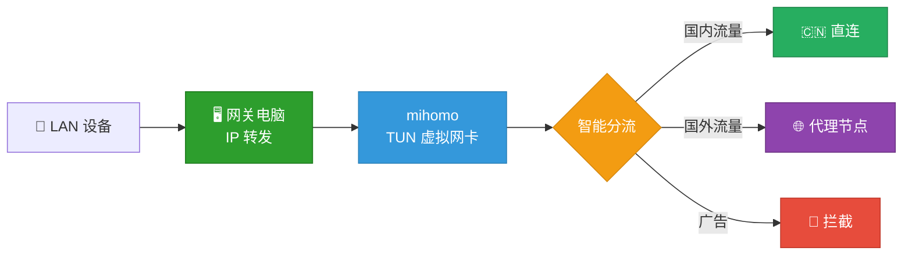

# LAN Proxy Gateway

**不刷固件、不买软路由，一条命令把你的电脑变成全屋科学上网网关。**

支持 **macOS / Linux / Windows** 三平台。Switch 看 YouTube、Apple TV 刷 Netflix、PS5 联机加速 —— 只要设备能连 Wi-Fi，改个网关就能用。


## 为什么做这个

家里总有些设备**装不了代理软件**：Switch、Apple TV、PS5、智能电视……

常见方案是刷路由器固件或买一台软路由，但——
- 刷固件有变砖风险，配置复杂
- 软路由又要额外花钱，还占地方

其实你的电脑就是最好的网关。这个项目把整个过程封装成一个 CLI 工具，不需要你懂网络知识。

## 支持的设备和场景

| 设备 | 场景 | 效果 |
|------|------|------|
| **Nintendo Switch** | eShop、YouTube、在线联机 | 直连国际服，看 YouTube 无压力 |
| **Apple TV** | Netflix、Disney+、YouTube、HBO | 4K 流畅播放，告别转圈 |
| **PS5 / Xbox** | PSN 商店、在线对战、下载加速 | 联机稳定，下载提速 |
| **智能电视** | YouTube、Netflix、流媒体 App | 大屏观影体验拉满 |
| **IoT 设备** | 任何能改网关的设备 | 都能用 |

## 快速开始

### 你需要准备

- 一台电脑（Mac / Linux / Windows）
- [mihomo](https://github.com/MetaCubeX/mihomo) 内核（安装向导会引导你）
- 一个代理来源：**订阅链接**（机场提供的 URL）或 **Clash 配置文件**

### 安装

**方式一：下载编译好的二进制**

从 [Releases](https://github.com/Tght1211/lan-proxy-gateway/releases) 下载对应平台的文件，放到 PATH 中即可。

**方式二：从源码编译**（需要 [Go 1.21+](https://go.dev/dl/)）

```bash
git clone https://github.com/Tght1211/lan-proxy-gateway.git
cd lan-proxy-gateway
make install   # 编译并安装到 /usr/local/bin（会要求输入 sudo 密码）
```

### 三步完成

```bash
# 1. 安装向导（引导你配置订阅链接或本地配置文件）
gateway install

# 2. 启动网关
sudo gateway start

# 3. 查看状态
gateway status
```

启动后终端会显示你的 IP，把其他设备的**网关**和 **DNS** 改成这个 IP 就行了。

### 日常使用

```bash
gateway status               # 查看状态：节点、连接数、流量
sudo gateway start           # 启动网关
sudo gateway stop            # 停止网关
gateway switch               # 查看当前代理来源
gateway switch url           # 切换到订阅链接模式
gateway switch file /path    # 切换到配置文件模式
sudo gateway service install # 开机自启动
```

## 代理来源

支持两种代理来源，可随时切换：

| 模式 | 说明 | 用法 |
|------|------|------|
| **订阅链接** | 机场提供的 Clash/mihomo URL，自动拉取节点 | `gateway switch url` |
| **配置文件** | 本地 Clash/mihomo YAML 文件，自动提取 proxies | `gateway switch file /path/to/config.yaml` |

## 设备配置

启动后，在需要科学上网的设备上，把网络设置改为**手动**：

| 设置项 | 填什么 |
|--------|--------|
| IP 地址 | 同网段随便一个没用过的 IP（如 `192.168.1.100`） |
| 子网掩码 | `255.255.255.0` |
| 网关 | 网关电脑的 IP（`gateway start` 会告诉你） |
| DNS | 网关电脑的 IP（同上） |

> **各设备详细设置指南：**
> - [Nintendo Switch](docs/switch-setup.md)
> - [Apple TV](docs/appletv-setup.md)
> - [PS5 / Xbox](docs/ps5-setup.md)
> - [iPhone / Android 手机](docs/phone-setup.md)

## 工作原理



1. 网关电脑开启 IP 转发，充当局域网网关
2. mihomo 以 TUN 模式运行，创建虚拟网卡透明接管所有流量
3. 智能分流：国内网站直连、国外走代理、广告直接拦截
4. 节点通过 `proxy-providers` 自动拉取，无需手动配置

## 跨平台支持

| 平台 | IP 转发 | 防火墙 | 系统服务 | 状态 |
|------|---------|--------|----------|------|
| **macOS** | `sysctl` | `pfctl` | launchd | 已验证 |
| **Linux** | `/proc/sys` | — | systemd | 已实现 |
| **Windows** | `netsh` | — | `sc.exe` | 已实现 |

交叉编译：

```bash
make build-all   # 一次编译 5 个平台二进制（dist/ 目录下）
```

## 配置文件

安装向导会自动生成 `gateway.yaml`，你也可以手动编辑：

```yaml
proxy_source: url                     # "url" 或 "file"
subscription_url: "https://..."       # 订阅链接
# proxy_config_file: /path/to/config  # 本地配置文件
subscription_name: subscription
ports:
  mixed: 7890
  redir: 7892
  api: 9090
  dns: 53
api_secret: ""
```

> 从旧版 `.secret` 格式迁移？运行 `gateway install` 会自动检测并迁移。

## 隐私安全

你的订阅链接是敏感信息。本项目做了隔离，确保不会泄露：

| 文件 | 会上传 GitHub 吗 | 内容 |
|------|:---:|------|
| `embed/template.yaml` | Yes | 只有配置框架，`{{变量}}` 占位 |
| `gateway.yaml` | **No** | 你的订阅 URL，仅存本地 |
| `data/config.yaml` | **No** | 运行时自动生成，包含实际配置 |

## 项目结构

```
lan-proxy-gateway/
├── main.go                       # 入口
├── cmd/                          # CLI 子命令
│   ├── root.go                   # 根命令 + 全局 flag
│   ├── install.go                # gateway install
│   ├── start.go                  # gateway start
│   ├── stop.go                   # gateway stop
│   ├── status.go                 # gateway status
│   ├── switch.go                 # gateway switch
│   └── service.go                # gateway service install/uninstall
├── internal/
│   ├── platform/                 # 跨平台抽象 (darwin/linux/windows)
│   ├── config/                   # 配置管理 + .secret 迁移
│   ├── mihomo/                   # API 客户端 + GeoIP 下载
│   ├── template/                 # 模板渲染
│   ├── proxy/                    # 代理节点提取
│   └── ui/                       # 终端彩色输出
├── embed/template.yaml           # mihomo 配置模板 (go:embed)
├── gateway.example.yaml          # 配置文件示例
├── Makefile                      # 构建脚本
└── docs/                         # 设备设置指南
```

## FAQ

**Q: 必须用 Mac 吗？**
> 不是。macOS / Linux / Windows 都支持。Mac Mini 功耗低适合常驻，但任何电脑都行。

**Q: 为什么要 sudo？**
> TUN 模式需要创建虚拟网卡和修改系统路由表，这些是系统级操作。

**Q: Apple TV 看 Netflix 会卡吗？**
> 取决于你的代理节点质量。节点够快的话 4K 没问题。可以通过 Web 面板（`http://网关IP:9090/ui`）切换节点。

**Q: 怎么切换节点？**
> 浏览器打开 `http://网关IP:9090/ui`（mihomo 管理面板），或运行 `gateway status` 查看当前节点。

**Q: 怎么切换订阅链接和配置文件？**
> `gateway switch url` 或 `gateway switch file /path/to/config.yaml`，一条命令搞定。

**Q: 关掉网关电脑后其他设备怎么办？**
> 需要把设备的网络设置改回"自动获取"，否则无法上网。

**Q: 和软路由比有什么优缺点？**
> | | LAN Proxy Gateway | 软路由 |
> |---|---|---|
> | 成本 | 利用现有电脑，零成本 | 需要额外买设备 |
> | 配置难度 | 一个 CLI 命令 | 刷固件 + 配置 OpenWrt |
> | 跨平台 | macOS / Linux / Windows | 通常仅 Linux |
> | 稳定性 | 电脑有时需要重启 | 专用设备更稳定 |
> | 适合场景 | 家里有闲置电脑的用户 | 追求 7×24 极致稳定 |

## License

[MIT](LICENSE)
