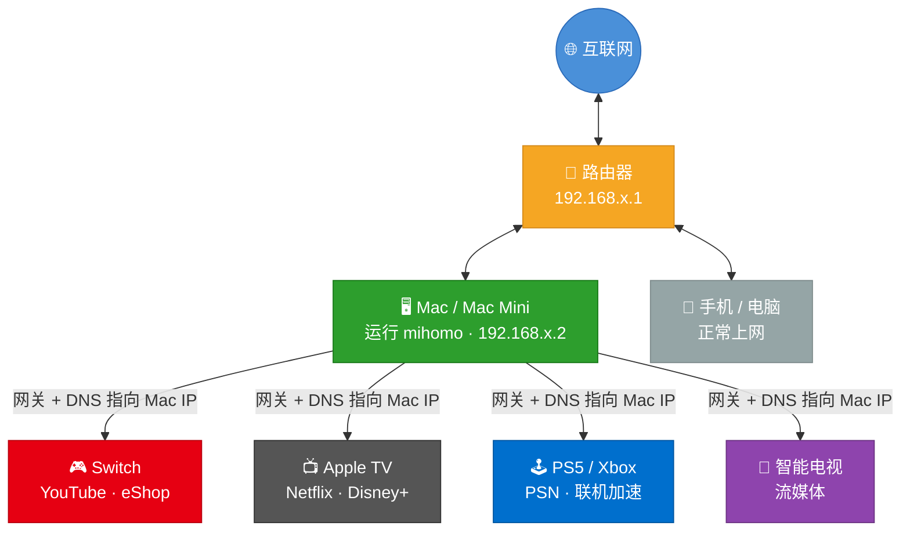
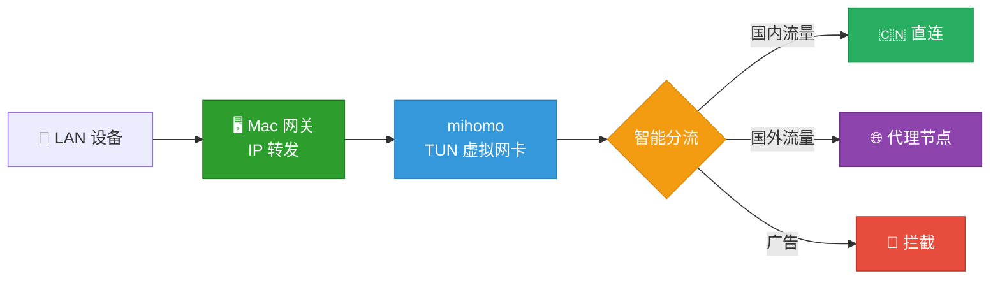

# LAN Proxy Gateway

**不刷固件、不买软路由，一条命令把 Mac / Mac Mini 变成全屋科学上网网关。**

Switch 看 YouTube、Apple TV 刷 Netflix、PS5 联机加速 —— 只要设备能连 Wi-Fi，改个网关就能用。



## 为什么做这个

家里总有些设备**装不了代理软件**：Switch、Apple TV、PS5、智能电视……

常见方案是刷路由器固件或买一台软路由，但——
- 刷固件有变砖风险，配置复杂
- 软路由又要额外花钱，还占地方

其实你的 **Mac（特别是常年开着的 Mac Mini）** 就是最好的网关。这个项目把整个过程封装成三条命令，不需要你懂网络知识。

## 支持的设备和场景

| 设备 | 场景 | 效果 |
|------|------|------|
| **Nintendo Switch** | eShop、YouTube、在线联机 | 直连国际服，看 YouTube 无压力 |
| **Apple TV** | Netflix、Disney+、YouTube、HBO | 4K 流畅播放，告别转圈 |
| **PS5 / Xbox** | PSN 商店、在线对战、下载加速 | 联机稳定，下载提速 |
| **智能电视** | YouTube、Netflix、流媒体 App | 大屏观影体验拉满 |
| **IoT 设备** | 任何能改网关的设备 | 都能用 |

## 快速开始

### 你需要准备

- 一台 Mac（推荐 Mac Mini 常驻运行，MacBook 也行）
- [Homebrew](https://brew.sh/)（Mac 包管理器）
- 一个代理订阅链接（机场提供的 Clash/mihomo 格式 URL）

### 三步完成

```bash
# 1. 下载
git clone https://github.com/Tght1211/lan-proxy-gateway.git
cd lan-proxy-gateway

# 2. 安装（会引导你输入��阅链接）
bash install.sh

# 3. 启动
sudo ./start.sh
```

启动后终端会显示你的 Mac IP，把其他设备的**网关**和 **DNS** 改成这个 IP 就行了。

### 日常使用

```bash
sudo ./start.sh    # 启动网关
./status.sh        # 查看状态：节点、连接数、流量
sudo ./stop.sh     # 停止网关
```

## 设备配置

启动后，在需要科学上网的设备上，把网络设置改为**手动**：

| 设置项 | 填什么 |
|--------|--------|
| IP 地址 | 同网段随便一个没用过的 IP（如 `192.168.1.100`） |
| 子网掩码 | `255.255.255.0` |
| 网关 | Mac 的 IP（`start.sh` 会告诉你） |
| DNS | Mac 的 IP（同上） |

> **各设备详细设置指南：**
> - [Nintendo Switch](docs/switch-setup.md)
> - [Apple TV](docs/appletv-setup.md)
> - [PS5 / Xbox](docs/ps5-setup.md)
> - [iPhone / Android 手机](docs/phone-setup.md)

## 工作原理



1. Mac 开启 IP 转发，充当局域网网关
2. mihomo 以 TUN 模式运行，创建虚拟网卡透明接管所有流量
3. 智能分流：国内网站直连、国外走代理、广告直接拦截
4. 节点通过 `proxy-providers` 从你的订阅链接自动拉取，无需手动配置

## 隐私安全

你的订阅链接是敏感信息。本项目做了三层隔离，确保不会泄露：

| 文件 | 会上传 GitHub 吗 | 内容 |
|------|:---:|------|
| `config/template.yaml` | Yes | 只有配置框架，`{{变量}}` 占位 |
| `.secret` | **No** | 你的订阅 URL，仅存本地 |
| `data/config.yaml` | **No** | 运行时自动生成，包含实际配置 |

## 项目结构

```
lan-proxy-gateway/
├── install.sh            # 一键安装向导
├── start.sh              # 启动网关
├── stop.sh               # 停止网关
├── status.sh             # 状态面板
├── lib/
│   ├── common.sh         # 通用工具函数
│   ├── detect.sh         # 自动检测（网卡、IP、架构）
│   └── config.sh         # 配置渲染
├── config/
│   └── template.yaml     # mihomo 配置模板
├── .secret.example       # 敏感配置示例
└── docs/
    ├── switch-setup.md   # Switch 设置指南
    ├── appletv-setup.md  # Apple TV 设置指南
    ├── ps5-setup.md      # PS5 设置指南
    └── phone-setup.md    # 手机/平板设置指南
```

## FAQ

**Q: 必须用 Mac Mini 吗？**
> 不是。任何 Mac 都行，MacBook 也可以。但 Mac Mini 功耗低、不占地方、常年开着刚好，是最适合当网关的选择。

**Q: 为什么要 sudo？**
> TUN 模式需要创建虚拟网卡和修改系统路由表，这些是系统级操作。

**Q: Apple TV 看 Netflix 会卡吗？**
> 取决于你的代理节点质量。节点够快的话 4K 没问题。可以通过 `status.sh` 或 Web 面板（`http://Mac的IP:9090/ui`）切换节点。

**Q: Switch 能看 YouTube 吗？**
> 可以。配好网关后 Switch 的 YouTube App 可以直接使用。

**Q: 怎么切换节点？**
> 两种方式：
> 1. 浏览器打开 `http://Mac的IP:9090/ui`（mihomo 管理面板）
> 2. 命令行运行 `./status.sh` 查看当前节点

**Q: 关掉 Mac 后其他设备怎么办？**
> 需要把设备的网络设置改回"自动获取"，否则无法上网。

**Q: 和软路由比有什么优缺点？**
> | | LAN Proxy Gateway | 软路由 |
> |---|---|---|
> | 成本 | 利用现有 Mac，零成本 | 需要额外买设备 |
> | 配置难度 | 三条命令 | 刷固件 + 配置 OpenWrt |
> | 稳定性 | Mac 有时需要重启/合盖 | 专用设备更稳定 |
> | 适合场景 | 家里有 Mac Mini 的用户 | 追求 7×24 极致稳定 |

## License

[MIT](LICENSE)
