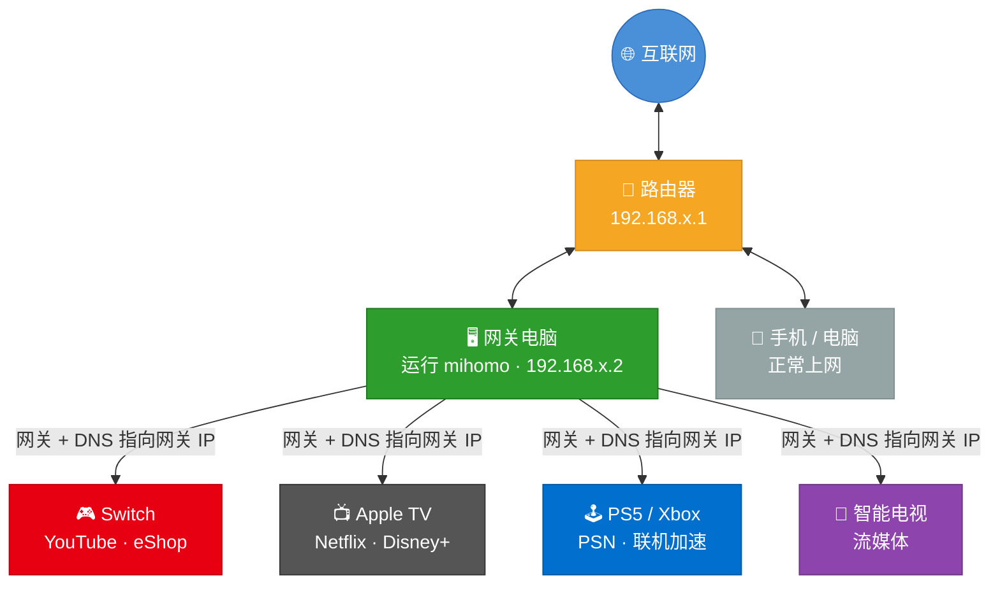
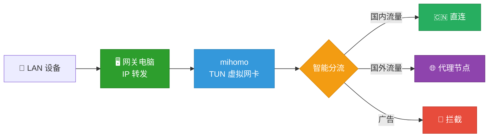

# LAN Proxy Gateway

[English](README_EN.md)

[](https://github.com/Tght1211/lan-proxy-gateway/releases)
[](https://github.com/Tght1211/lan-proxy-gateway/stargazers)
[](LICENSE)
[](https://go.dev/)

把你的电脑变成一台局域网透明代理网关。  
不刷路由器、不买软路由，`Switch / PS5 / Apple TV / 智能电视 / 手机` 改个网关和 DNS 就能用。

这个项目基于 `mihomo`，重点做两件事：

- `局域网共享`：让不能装代理 App 的设备也能走透明代理
- `链式代理`：让 Claude / ChatGPT / Codex / Cursor 更适合走住宅出口

> 完全开源，中文优先，主要用于网络与代理技术学习、家庭网关实践和 CLI / TUI 交互探索。


```mermaid
graph TD
    Internet(("🌐 互联网"))
    Router["🔲 路由器<br/>192.168.x.1"]
    Mac["🖥 网关电脑<br/>运行 mihomo · 192.168.x.2"]
    Switch["🎮 Switch<br/>YouTube · eShop"]
    ATV["📺 Apple TV<br/>Netflix · Disney+"]
    PS5["🕹 PS5 / Xbox<br/>PSN · 联机加速"]
    TV["📡 智能电视<br/>流媒体"]
    Phone["📱 手机 / 电脑<br/>正常上网"]

    Internet <--> Router
    Router <--> Mac
    Router <--> Phone
    Mac -- "网关 + DNS 指向网关 IP" --> Switch
    Mac -- "网关 + DNS 指向网关 IP" --> ATV
    Mac -- "网关 + DNS 指向网关 IP" --> PS5
    Mac -- "网关 + DNS 指向网关 IP" --> TV

    style Mac fill:#2d9e2d,color:#fff,stroke:#1a7a1a
    style Internet fill:#4a90d9,color:#fff,stroke:#2a6ab9
    style Router fill:#f5a623,color:#fff,stroke:#d4891a
    style Switch fill:#e60012,color:#fff,stroke:#b8000e
    style ATV fill:#555,color:#fff,stroke:#333
    style PS5 fill:#006fcd,color:#fff,stroke:#0055a0
    style TV fill:#8e44ad,color:#fff,stroke:#6c3483
    style Phone fill:#95a5a6,color:#fff,stroke:#7f8c8d
```

## 为什么值得用

很多设备并不适合直接装代理：

- Switch、PS5、Apple TV、智能电视本身就难装
- 手机、平板、备用机不想每台都重复配置
- 路由器刷机成本高，软路由又多一台设备

LAN Proxy Gateway 的思路很简单：

1. 让电脑接管局域网设备的出口
2. 把分流、规则、节点、链式代理都收进一个 CLI 系统里

## 和 Clash Verge 的“允许局域网连接”有什么区别

| 对比项 | Clash Verge 局域网代理 | LAN Proxy Gateway |
|---|---|---|
| 代理层级 | 应用层代理 | 网络层透明代理 |
| 设备配置方式 | 填代理服务器地址 | 改网关和 DNS |
| Switch / Apple TV / PS5 | 部分场景受限 | 更适合整机透明接管 |
| App 是否感知代理 | 往往能感知 | 更接近真实网关 |
| 典型使用方式 | 单设备代理 | 全屋设备共享 |

如果你更看重“家里别的设备一起用”，这个项目更接近软路由体验。

## 核心能力

### 1. 局域网透明共享

- 设备改网关和 DNS 即可接入
- 支持 `Switch / PS5 / Apple TV / 智能电视 / 手机 / 平板`
- 支持 `TUN` 模式和 `本机绕过代理`

### 2. Chains 链式代理

```text
你的设备 -> 机场节点 -> 住宅代理 -> Claude / ChatGPT / Codex / Cursor
```

适合：

- Claude / ChatGPT 注册和使用
- Codex / Cursor 等 AI 编程工具
- 日常流量走机场，AI 流量走住宅出口

### 3. 运行中控制台

`gateway start` 成功后直接进入 TUI 控制台，支持：

- `/status` `/config` `/chains` `/groups` `/logs`
- `Ctrl+P` 打开策略组和节点选择器
- 确认流、日志查看、状态摘要

### 4. 规则系统

默认内置：

- 局域网和保留地址直连
- 国内常见服务直连
- Apple / Nintendo 相关规则
- 广告与跟踪域名拦截
- 国外网站和 AI 服务代理

## 3 分钟快速开始

### 1. 安装

中国大陆网络优先用 CDN 入口：

#### macOS / Linux

```bash
curl -fsSL https://cdn.jsdelivr.net/gh/Tght1211/lan-proxy-gateway@main/install.sh | bash
```

备用：

```bash
curl -fsSL https://raw.githubusercontent.com/Tght1211/lan-proxy-gateway/main/install.sh | bash
```

#### Windows PowerShell

```powershell
irm https://cdn.jsdelivr.net/gh/Tght1211/lan-proxy-gateway@main/install.ps1 | iex
```

备用：

```powershell
irm https://raw.githubusercontent.com/Tght1211/lan-proxy-gateway/main/install.ps1 | iex
```

如果你所在网络直连 GitHub 不稳定，也可以手动指定镜像：

```bash
GITHUB_MIRROR=https://hub.gitmirror.com/ bash install.sh
```

### 2. 初始化

```bash
gateway install
```

向导会帮你完成：

1. 下载 `mihomo`
2. 录入订阅链接或本地配置文件
3. 生成 `gateway.yaml`

### 3. 启动

```bash
sudo gateway start
```

启动成功后会显示：

- 当前读取的配置文件路径
- 局域网共享入口 IP
- 运行模式
- 出口摘要
- 运行中 TUI 控制台

### 4. 让其他设备接入

把设备的：

- `网关 (Gateway)` 改成你电脑的局域网 IP
- `DNS` 改成同一个 IP

设备说明：

- [iPhone / Android](docs/phone-setup.md)
- [Nintendo Switch](docs/switch-setup.md)
- [PS5](docs/ps5-setup.md)
- [Apple TV](docs/appletv-setup.md)
- [智能电视](docs/tv-setup.md)

## 常用命令

| 命令 | 说明 |
|---|---|
| `gateway install` | 初始化向导 |
| `gateway config` | 交互式配置中心 |
| `sudo gateway start` | 启动网关并进入运行中控制台 |
| `gateway status` | 查看运行状态和出口网络 |
| `gateway chains` | 链式代理向导 |
| `gateway switch` | 切换代理来源和扩展模式 |
| `gateway skill` | 查看 AI skill 信息 |
| `gateway permission install` | 安装免密控制权限 |
| `sudo gateway update` | 升级到最新版 |

完整命令见 [docs/commands.md](docs/commands.md)。

## 工作原理


```mermaid
flowchart LR
    Device["📱 LAN 设备"] --> Mac["🖥 网关电脑<br/>IP 转发"]
    Mac --> TUN["mihomo<br/>TUN 虚拟网卡"]
    TUN --> Rules{"智能分流"}
    Rules -- "国内流量" --> Direct["🇨🇳 直连"]
    Rules -- "国外流量" --> Proxy["🌐 代理节点"]
    Rules -- "广告" --> Block["🚫 拦截"]

    style Mac fill:#2d9e2d,color:#fff,stroke:#1a7a1a
    style TUN fill:#3498db,color:#fff,stroke:#2980b9
    style Rules fill:#f39c12,color:#fff,stroke:#d68910
    style Direct fill:#27ae60,color:#fff,stroke:#1e8449
    style Proxy fill:#8e44ad,color:#fff,stroke:#6c3483
    style Block fill:#e74c3c,color:#fff,stroke:#c0392b
```

1. 电脑开启 IP 转发，充当局域网网关
2. `mihomo` 以 TUN 模式接管流量
3. 规则系统决定直连、代理或拦截
4. chains 模式下，AI 流量还能继续接到住宅出口

## 配置结构

当前配置围绕 4 个区块组织：

```yaml
proxy:
runtime:
rules:
extension:
```

对应职责：

- `proxy`：代理来源
- `runtime`：运行参数和局域网共享
- `rules`：分流与拦截
- `extension`：chains 或脚本扩展

旧版顶层配置仍兼容读取。

## Release 下载

- [GitHub Releases](https://github.com/Tght1211/lan-proxy-gateway/releases)

| 系统 | 下载 |
|---|---|
| macOS Apple Silicon | [gateway-darwin-arm64](https://github.com/Tght1211/lan-proxy-gateway/releases/latest/download/gateway-darwin-arm64) / [gateway-darwin-arm64.tar.gz](https://github.com/Tght1211/lan-proxy-gateway/releases/latest/download/gateway-darwin-arm64.tar.gz) |
| macOS Intel | [gateway-darwin-amd64](https://github.com/Tght1211/lan-proxy-gateway/releases/latest/download/gateway-darwin-amd64) / [gateway-darwin-amd64.tar.gz](https://github.com/Tght1211/lan-proxy-gateway/releases/latest/download/gateway-darwin-amd64.tar.gz) |
| Linux x86_64 | [gateway-linux-amd64](https://github.com/Tght1211/lan-proxy-gateway/releases/latest/download/gateway-linux-amd64) / [gateway-linux-amd64.tar.gz](https://github.com/Tght1211/lan-proxy-gateway/releases/latest/download/gateway-linux-amd64.tar.gz) |
| Linux ARM64 | [gateway-linux-arm64](https://github.com/Tght1211/lan-proxy-gateway/releases/latest/download/gateway-linux-arm64) / [gateway-linux-arm64.tar.gz](https://github.com/Tght1211/lan-proxy-gateway/releases/latest/download/gateway-linux-arm64.tar.gz) |
| Windows x86_64 | [gateway-windows-amd64.exe](https://github.com/Tght1211/lan-proxy-gateway/releases/latest/download/gateway-windows-amd64.exe) / [gateway-windows-amd64.zip](https://github.com/Tght1211/lan-proxy-gateway/releases/latest/download/gateway-windows-amd64.zip) |

Release 会同时提供：

- 原始二进制
- 压缩包
- `SHA256SUMS`
- 升级说明

## 文档导航

- [命令总览](docs/commands.md)
- [进阶配置](docs/advanced.md)
- [常见问题](docs/faq.md)
- [版本规划](docs/versioning.md)
- [Switch 配置](docs/switch-setup.md)
- [PS5 配置](docs/ps5-setup.md)
- [Apple TV 配置](docs/appletv-setup.md)
- [手机配置](docs/phone-setup.md)

## 开源说明

本项目完全开源，主要用于：

- 网络与代理技术学习
- 家庭局域网网关实践
- TUN / 透明代理 / 分流规则研究
- AI 客户端与 CLI / TUI 交互设计探索

请在你所在地区法律法规允许的前提下使用。

## License

[MIT](LICENSE)
