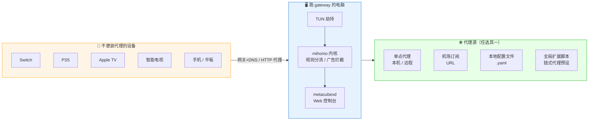

# LAN Proxy Gateway

[](https://go.dev/)
[](https://github.com/Tght1211/lan-proxy-gateway/releases)
[](LICENSE)
[]()

> **把一台电脑变成整屋的代理网关** —— 一台机器上配好代理，整屋设备（手机 / 平板 / Switch / PS5 / Apple TV / 智能电视）跟着一起用，不用每台都装代理 App。

面向**非编程玩家**：一键安装、中文菜单、内嵌 Web 控制台、配置全程引导式。

对 **Switch 游戏加速、Splatoon 3（喷喷3）联机加速、Switch eShop 下载加速、PS5 PSN 商店下载加速、Steam / Epic 游戏下载加速**这类「设备本身没代理 App 可装」的场景尤其合用 —— 走家里这台电脑出门就完事了，主机本身不用动。

---

## ✨ 能干什么

### 🌟 招牌能力 · LAN 透明网关（整屋共享代理）

这是项目的**核心价值** —— 把手上这台 PC 变成整屋的代理出口，局域网内其它设备**零配置 / 最小配置**就能跟着走代理。两种共享模式，按系统支持度自动降级：

| 系统 | 网关级共享（设备改网关 + DNS） | 代理级共享（设备设 HTTP 代理）|
|---|---|---|
| **macOS / Linux** | ✅ 全支持 | ✅ |
| **Windows 家用版** | ❌ 没 RRAS / 家用版无法做 NAT | ✅ 唯一可用 |

- **网关级** = 设备把路由器换成这台 PC，所有流量（包括 Switch / PS5 / Apple TV / 智能电视这类**不能设代理只能改网关**的设备）全部接管。基于 mihomo TUN + iptables / pf NAT。
- **代理级** = 设备手动填 `电脑IP:17890` 当 HTTP 或 SOCKS5 代理。App 自己主动把流量交出来，适用于 iPhone / Android / 电脑浏览器扩展这类**能手动设代理**的场景。Windows 下所有设备（包括手机）都走这条。

**典型受益场景**：
- 📱 **iPhone / iPad 用户不想 / 不方便装 VPN App**（App Store 审查 / 企业设备管控 / 老机型装不了 / 嫌 VPN 耗电）—— 家里电脑做一台共享代理网关，手机 Wi-Fi 设置里改下代理 / 网关就能上，App 自己不用改
- 🎮 **游戏机 / 智能电视 / 盒子**（Switch / PS5 / Apple TV / 小米盒子）—— 这些根本没代理 App 可装的设备，只能靠网关级（**macOS / Linux 可以**；Windows 做不到）。常见玩法：**Switch 联机加速**（Splatoon 3 喷喷3 / 马里奥赛车 / 宝可梦对战 / 怪物猎人 / 任天堂在线对战）、**Switch eShop 下载加速**、**PSN / PS5 商店下载加速**、**Steam / Epic / Xbox 游戏下载加速** —— 走家里电脑出口，比主机直连机场 / 港日服稳得多
- 👨‍👩‍👧 **家里多台设备一起要代理** —— 每台都装代理客户端太麻烦，一台 PC 配好就全家通吃
- 🖥️ **不想在每台电脑重复配订阅** —— 订阅链接只放在这一台，局域网其他 Mac/Windows/Linux 都共用
- 🔁 **给现有代理软件补功能（二次代理）** —— 已经在用 Clash Verge / Clash for Windows / V2RayN / Mihomo Party / sing-box，但它们**不支持链式代理**（机场起飞 + 住宅 IP 落地）、或者 **LAN 共享只是开端口，Switch / PS5 等不能设代理的设备根本接不上**？把 gateway 套在前面，复用现有客户端的节点池，瞬间补齐：链式代理 + TUN 网关 + 整屋 LAN 共享，原客户端不用换、不用动配置

👉 详细的设备接入步骤（方式 1 改网关 / 方式 2 设代理 / 方式 3 本机也走规则）见 [docs/device-setup.md](docs/device-setup.md)。

---

### 🚀 次级能力 · 灵活的代理源 + 可扩展脚本（含住宅 IP 链式预设）

本项目**不自带节点**，而是接在你现有的代理供给之上做"共享 + 分流 + 扩展"。三种代理源任选：

- **🔗 订阅链接** —— 机场给的 Clash/mihomo 订阅 URL，粘进去就行。节点、分组、规则全部 inline 到 mihomo，机场的自定义分组完整生效
- **📄 本地配置文件** —— 已有的 `.yaml`（`proxies` 段或完整 mihomo 配置），指路径就用
- **🔌 已有代理端口（Clash Verge / V2RayN / Mihomo Party / sing-box 等第三方客户端二次代理）** —— 本机在跑 Clash Verge / Clash for Windows / V2RayN / Mihomo Party / sing-box？直接把它的本地端口（如 `127.0.0.1:7897`）填进来当 gateway 的上游即可；远程机场的某个节点 IP:Port 也支持。**特别适合给上述第三方客户端补「链式代理 + Switch / PS5 等设备的 LAN 网关共享」两个能力**，不用换软件

**基于以上代理源做"全局扩展脚本"**（`goja` 跑的 JS，在最后一步修改 mihomo 配置），提供强大改写能力。**内置一个开箱即用的预设**：

🏠 **住宅 IP 链式代理** —— AI 网站（Claude / OpenAI / Cursor）对机房 IP 风控越来越狠，单跳机场节点经常被拉黑。预设一键生成「机场起飞 + 住宅 IP 落地」链式代理，AI 网站看到的是家庭宽带 ASN，YouTube / Google Drive 等走机场、国内直连，互不干扰。

👉 完整玩法 + 流量路径图 + 验证方法见 [docs/scenarios.md](docs/scenarios.md) 的"场景三"。

---

### 🔧 再次级能力 · 周边增强

- 🌐 **内嵌 metacubexd Web 控制台** —— 浏览器 `http://ip:19090/ui/`，切节点 / 改规则 / 看流量；手机平板也能进；`go:embed` 进 binary 开箱即用
- ⚡ **自动自愈** —— 代理源挂了 30 秒内 supervisor 自动切到直连保命（LAN 不断网），恢复后切回原模式
- 🎯 **自定义规则 UI** —— 菜单里增删 DOMAIN-SUFFIX / IP-CIDR / PROCESS-NAME / GEOSITE 规则，优先级盖过内置
- 📊 **节点测速 + 排序** —— 进切节点页面自动并发测延迟，按速度升序
- 🤖 **AI 运维 Skill** —— 附带 `~/.claude/skills/lan-proxy-gateway-ops/SKILL.md`，Claude Code 能直接通过 mihomo REST API 帮你切节点 / 排错 / 加规则
- 📱 **混合代理端口** —— 同时开 HTTP + SOCKS5（默认 `17890`，避开 Clash 7890）
- 💻 **方式 3 · 本机也走规则** —— TUN 开着自动生效；或菜单按 `L` 把本机 DNS 切到 127.0.0.1（macOS 自动覆盖所有活跃网卡）
- 🗒️ **日志易读视图** —— mihomo 英文日志自动翻译成中文（`🟡 01:27:55 TCP 直连 xxx → 超时`）

---

## 🚀 一键安装

### macOS / Linux

```bash
curl -fsSL https://raw.githubusercontent.com/Tght1211/lan-proxy-gateway/main/install.sh | bash
```

### Windows（管理员 PowerShell）

```powershell
irm https://raw.githubusercontent.com/Tght1211/lan-proxy-gateway/main/install.ps1 | iex
```

脚本装完自动进入配置向导（问代理源 → 启动 → 问开机自启），整条流在一个终端里走完。

### 升级 / 回退

```bash
sudo gateway update          # 升级到最新版本
sudo gateway update v3.4.3   # 更新或回退到指定版本
```

### 国内访问 GitHub 慢？

下载会按顺序尝试镜像（`hub.gitmirror.com` / `mirror.ghproxy.com` / `github.moeyy.xyz` / `gh.ddlc.top`）。也可以手动指定：

```bash
GITHUB_MIRROR=https://你的镜像/ bash install.sh           # Linux / macOS
$env:GITHUB_MIRROR = "https://你的镜像/"; gateway install   # Windows
```

本机已经有 Clash Verge / Clash for Windows 在跑的话，让下载走它更稳：

```powershell
$env:HTTP_PROXY = "http://127.0.0.1:7897"; gateway install
```

---

## 🎬 整体架构


```mermaid
flowchart LR
    subgraph Devices["📱 不便装代理的设备"]
        S[Switch]
        P[PS5]
        T[Apple TV]
        TV[智能电视]
        M[手机 / 平板]
    end

    subgraph Host["🖥️ 跑 gateway 的电脑"]
        direction TB
        TUN[TUN 劫持]
        MH[mihomo 内核<br/>规则分流 / 广告拦截]
        UI[metacubexd<br/>Web 控制台]
        TUN --> MH
        MH --> UI
    end

    subgraph Sources["🌐 代理源（任选其一）"]
        E1[单点代理<br/>本机 / 远程]
        SUB[机场订阅<br/>URL]
        F[本地配置文件<br/>.yaml]
        SCR[全局扩展脚本<br/>链式代理预设]
    end

    Devices -- "网关+DNS / HTTP 代理" --> Host
    Host --> Sources

    style Devices fill:#fff5e6,stroke:#ff9900
    style Host fill:#e6f3ff,stroke:#0066cc
    style Sources fill:#e6ffe6,stroke:#00aa00
```

👉 三层架构 / 跨平台实现表 / 目录结构见 [docs/architecture.md](docs/architecture.md)。

---

## 📚 文档索引

| 想干什么 | 看这里 |
|---|---|
| 手机 / 游戏机 / 电脑怎么接入 gateway | [docs/device-setup.md](docs/device-setup.md) |
| 手机配置带截图的详细步骤 | [docs/phone-setup.md](docs/phone-setup.md) |
| Switch / PS5 / Apple TV / 智能电视 | [switch](docs/switch-setup.md) · [ps5](docs/ps5-setup.md) · [appletv](docs/appletv-setup.md) · [tv](docs/tv-setup.md) |
| 典型场景玩法（含 AI 住宅 IP 链式代理招牌教程） | [docs/scenarios.md](docs/scenarios.md) |
| 完整命令行 + 主菜单一览 | [docs/commands.md](docs/commands.md) |
| 配置文件 schema / 进阶调优 | [docs/advanced.md](docs/advanced.md) |
| 常见问题 | [docs/faq.md](docs/faq.md) |
| 架构、跨平台实现、手动编译、目录结构 | [docs/architecture.md](docs/architecture.md) |
| 版本发布流程 | [docs/release-process.md](docs/release-process.md) |

---

## 🤖 给 AI 用的 Skill

`~/.claude/skills/lan-proxy-gateway-ops/SKILL.md`：让 Claude Code / AI 代理通过 mihomo REST API 做日常运维（切节点 / 换模式 / 查日志）**无需 sudo**。需要 sudo 的动作走 sudoers NOPASSWD 白名单或建议走系统 service。

---

## 🤝 贡献

欢迎 issue / PR！需要帮手的方向：

- Linux / Windows 一键 DNS 切换的实现
- 新的 ruleset 内置规则
- 英文 README / 文档（`README_EN.md` / `docs/en/`）
- mihomo 新 API 的 UI 接入
- Linux 真机验证（最新版 v3.2.0 Windows 真机测过，Linux 仅单元测试 + 交叉编译）

---

## 📜 License

[MIT](LICENSE) © 2025-2026 [Tght1211](https://github.com/Tght1211)

基于 [mihomo](https://github.com/MetaCubeX/mihomo)（Clash.Meta）内核 + [metacubexd](https://github.com/MetaCubeX/metacubexd) 控制台。

---

## ⭐ Star History

[](https://star-history.com/#Tght1211/lan-proxy-gateway&Date)

如果觉得有用，点个 Star ⭐ 支持一下吧~
