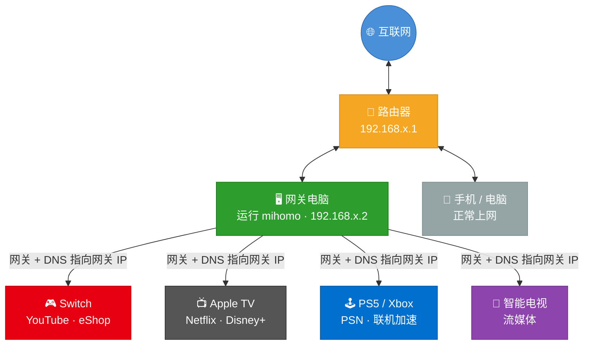
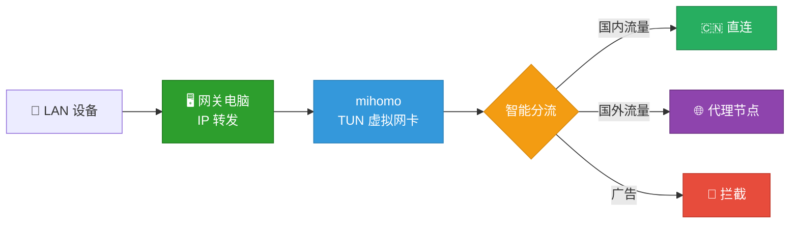

# LAN Proxy Gateway

**不刷固件、不买软路由，一条命令把你的电脑变成全屋科学上网网关。**

支持 **macOS / Linux / Windows** 三平台。Switch 看 YouTube、Apple TV 刷 Netflix、PS5 联机加速 —— 只要设备能连 Wi-Fi，改个网关就能用。


```mermaid
graph TD
    Internet(("🌐 互联网"))
    Router["🔲 路由器<br/>192.168.x.1"]
    Mac["🖥 网关电脑<br/>运行 mihomo · 192.168.x.2"]
    Switch["🎮 Switch<br/>YouTube · eShop"]
    ATV["📺 Apple TV<br/>Netflix · Disney+"]
    PS5["🕹 PS5 / Xbox<br/>PSN · 联机加速"]
    TV["📡 智能电视<br/>流媒体"]
    Phone["📱 手机 / 电脑<br/>正常上网"]

    Internet <--> Router
    Router <--> Mac
    Router <--> Phone
    Mac -- "网关 + DNS 指向网关 IP" --> Switch
    Mac -- "网关 + DNS 指向网关 IP" --> ATV
    Mac -- "网关 + DNS 指向网关 IP" --> PS5
    Mac -- "网关 + DNS 指向网关 IP" --> TV

    style Mac fill:#2d9e2d,color:#fff,stroke:#1a7a1a
    style Internet fill:#4a90d9,color:#fff,stroke:#2a6ab9
    style Router fill:#f5a623,color:#fff,stroke:#d4891a
    style Switch fill:#e60012,color:#fff,stroke:#b8000e
    style ATV fill:#555,color:#fff,stroke:#333
    style PS5 fill:#006fcd,color:#fff,stroke:#0055a0
    style TV fill:#8e44ad,color:#fff,stroke:#6c3483
    style Phone fill:#95a5a6,color:#fff,stroke:#7f8c8d
```

## 为什么做这个

家里总有些设备**装不了代理软件**：Switch、Apple TV、PS5、智能电视……

常见方案是刷路由器固件或买一台软路由，但——
- 刷固件有变砖风险，配置复杂
- 软路由又要额外花钱，还占地方

其实你的电脑就是最好的网关。这个项目把整个过程封装成一个 CLI 工具，不需要你懂网络知识。

## 支持的设备和场景

| 设备 | 场景 | 效果 |
|------|------|------|
| **Nintendo Switch** | eShop、YouTube、在线联机 | 直连国际服，看 YouTube 无压力 |
| **Apple TV** | Netflix、Disney+、YouTube、HBO | 4K 流畅播放，告别转圈 |
| **PS5 / Xbox** | PSN 商店、在线对战、下载加速 | 联机稳定，下载提速 |
| **智能电视** | YouTube、Netflix、流媒体 App | 大屏观影体验拉满 |
| **IoT 设备** | 任何能改网关的设备 | 都能用 |

## 快速开始

### 你需要准备

- 一台电脑（Mac / Linux / Windows）
- [mihomo](https://github.com/MetaCubeX/mihomo) 内核（安装向导会引导你）
- 一个代理来源：**订阅链接**（机场提供的 URL）或 **Clash 配置文件**

### 安装

**方式一：一键安装**（推荐）

macOS / Linux:

```bash
# 国际网络
curl -fsSL https://raw.githubusercontent.com/Tght1211/lan-proxy-gateway/main/install.sh | bash

# 国内镜像（二选一）
curl -fsSL https://raw.gitmirror.com/Tght1211/lan-proxy-gateway/main/install.sh | bash
curl -fsSL https://mirror.ghproxy.com/https://raw.githubusercontent.com/Tght1211/lan-proxy-gateway/main/install.sh | bash
```

Windows (PowerShell):

```powershell
# 国际网络
irm https://raw.githubusercontent.com/Tght1211/lan-proxy-gateway/main/install.ps1 | iex

# 国内镜像（二选一）
irm https://raw.gitmirror.com/Tght1211/lan-proxy-gateway/main/install.ps1 | iex
irm https://mirror.ghproxy.com/https://raw.githubusercontent.com/Tght1211/lan-proxy-gateway/main/install.ps1 | iex
```

脚本会自动检测网络环境，GitHub 直连超时时自动切换镜像下载二进制文件。macOS 安装到 `/usr/local/bin`，Linux 安装到 `/usr/local/bin` 或 `~/.local/bin`，Windows 安装到 `%LOCALAPPDATA%\Programs\gateway`。

> **如果以上命令都下载不了脚本？** 直接复制本项目中的文件内容到服务器上：
>
> **mihomo 安装**（必须先完成）：
> ```bash
> # 1. 复制以下内容到 download-mihomo.sh 并保存
> vim download-mihomo.sh
> # 粘贴 https://raw.githubusercontent.com/Tght1211/lan-proxy-gateway/main/download-mihomo.sh 内容
> chmod +x download-mihomo.sh
> ./download-mihomo.sh
> ```
>
> **gateway 安装**：
> ```bash
> # 2. 复制以下内容到 install.sh 并保存
> vim install.sh
> # 粘贴 https://raw.githubusercontent.com/Tght1211/lan-proxy-gateway/main/install.sh 内容
> chmod +x install.sh
> ./install.sh
> ```
>
> **终极方案**：在其他能访问 GitHub 的机器下载 mihomo，然后 scp 传到服务器：
> ```bash
> # 本地下载
> wget https://github.com/MetaCubeX/mihomo/releases/download/v1.19.8/mihomo-linux-amd64
> # 上传到服务器
> scp mihomo root@你的服务器IP:/usr/local/bin/
> ssh root@你的服务器IP "chmod +x /usr/local/bin/mihomo"
> ```

**方式二：手动下载**

从 [Releases](https://github.com/Tght1211/lan-proxy-gateway/releases) 下载对应你系统的文件：

| 你的电脑 | 下载哪个文件 |
|----------|-------------|
| **Mac（Apple 芯片：M1/M2/M3/M4）** | `gateway-darwin-arm64` |
| **Mac（Intel 芯片）** | `gateway-darwin-amd64` |
| **Linux（x86_64）** | `gateway-linux-amd64` |
| **Linux（ARM，如树莓派）** | `gateway-linux-arm64` |
| **Windows** | `gateway-windows-amd64.exe` |

> 不确定 Mac 是哪种芯片？点左上角  → "关于本机"，看到 M1/M2/M3/M4 就选 arm64，看到 Intel 就选 amd64。

下载后放到 PATH 中即可：

```bash
# macOS / Linux 示例
chmod +x gateway-*        # 添加执行权限
sudo mv gateway-* /usr/local/bin/gateway   # 移到 PATH 中
```

**方式三：从源码编译**（需要 [Go 1.21+](https://go.dev/dl/)）

```bash
git clone https://github.com/Tght1211/lan-proxy-gateway.git
cd lan-proxy-gateway
make install   # 编译并安装到 /usr/local/bin（会要求输入 sudo 密码）
```

### 三步完成

```bash
# 1. 安装向导（自动下载 mihomo，引导配置代理来源）
gateway install

# 2. 启动网关
sudo gateway start

# 3. 查看状态
gateway status
```

> 安装向导会自动下载并安装 mihomo 代理内核。如果遇到网络问题，会自动尝试镜像源下载。

启动后终端会显示你的 IP，把其他设备的**网关**和 **DNS** 改成这个 IP 就行了。

### 日常使用

```bash
gateway status               # 查看状态：节点、连接数、流量
sudo gateway start           # 启动网关
sudo gateway stop            # 停止网关
sudo gateway restart         # 重启网关
sudo gateway update          # 一键升级到最新版本
sudo gateway health          # 健康检查，异常时自动修复
gateway switch               # 查看当前代理来源
gateway switch url           # 切换到订阅链接模式
gateway switch file /path    # 切换到配置文件模式
sudo gateway service install # 开机自启动 + 定时健康检查
```

## 代理来源

支持两种代理来源，可随时切换：

| 模式 | 说明 | 用法 |
|------|------|------|
| **订阅链接** | 机场提供的 Clash/mihomo URL，自动拉取节点 | `gateway switch url` |
| **配置文件** | 本地 Clash/mihomo YAML 文件，自动提取 proxies | `gateway switch file /path/to/config.yaml` |

## 设备配置

启动后，在需要科学上网的设备上，把网络设置改为**手动**：

| 设置项 | 填什么 |
|--------|--------|
| IP 地址 | 同网段随便一个没用过的 IP（如 `192.168.1.100`） |
| 子网掩码 | `255.255.255.0` |
| 网关 | 网关电脑的 IP（`gateway start` 会告诉你） |
| DNS | 网关电脑的 IP（同上） |

> **各设备详细设置指南：**
> - [Nintendo Switch](docs/switch-setup.md)
> - [Apple TV](docs/appletv-setup.md)
> - [PS5 / Xbox](docs/ps5-setup.md)
> - [iPhone / Android 手机](docs/phone-setup.md)

## 工作原理


```mermaid
flowchart LR
    Device["📱 LAN 设备"] --> Mac["🖥 网关电脑<br/>IP 转发"]
    Mac --> TUN["mihomo<br/>TUN 虚拟网卡"]
    TUN --> Rules{"智能分流"}
    Rules -- "国内流量" --> Direct["🇨🇳 直连"]
    Rules -- "国外流量" --> Proxy["🌐 代理节点"]
    Rules -- "广告" --> Block["🚫 拦截"]

    style Mac fill:#2d9e2d,color:#fff,stroke:#1a7a1a
    style TUN fill:#3498db,color:#fff,stroke:#2980b9
    style Rules fill:#f39c12,color:#fff,stroke:#d68910
    style Direct fill:#27ae60,color:#fff,stroke:#1e8449
    style Proxy fill:#8e44ad,color:#fff,stroke:#6c3483
    style Block fill:#e74c3c,color:#fff,stroke:#c0392b
```

1. 网关电脑开启 IP 转发，充当局域网网关
2. mihomo 以 TUN 模式运行，创建虚拟网卡透明接管所有流量
3. 智能分流：国内网站直连、国外走代理、广告直接拦截
4. 节点通过 `proxy-providers` 自动拉取，无需手动配置

## 跨平台支持

| 平台 | IP 转发 | 防火墙 | 系统服务 | 状态 |
|------|---------|--------|----------|------|
| **macOS** | `sysctl` | `pfctl` | launchd | 已验证 |
| **Linux** | `/proc/sys` | — | systemd | 已实现 |
| **Windows** | `netsh` | — | `sc.exe` | 已实现 |

交叉编译：

```bash
make build-all   # 一次编译 5 个平台二进制（dist/ 目录下）
```

## 配置文件

安装向导会自动生成 `gateway.yaml`，你也可以手动编辑：

```yaml
proxy_source: url                     # "url" 或 "file"
subscription_url: "https://..."       # 订阅链接
# proxy_config_file: /path/to/config  # 本地配置文件
subscription_name: subscription
ports:
  mixed: 7890
  redir: 7892
  api: 9090
  dns: 53
api_secret: ""
# script_path: /etc/gateway/script.js  # 扩展脚本（可选，见下方说明）
```

> 从旧版 `.secret` 格式迁移？运行 `gateway install` 会自动检测并迁移。

## 扩展脚本（进阶功能）

如果你的机场订阅无法满足特殊需求，可以通过扩展脚本对生成的配置做二次加工。

**典型场景举例：**
- 订阅里没有住宅 IP / 静态 IP 节点，但你另外购买了住宅代理，想让 AI 网站（Claude、ChatGPT）走住宅 IP
- 需要把某个公司内网域名强制直连，绕过代理
- 订阅的分流规则不满意，想在最前面插入自定义规则

### 脚本格式

脚本格式与 **Clash Verge Rev 扩展脚本**完全兼容，是一个包含 `main` 函数的 JS 文件：

```js
// 脚本接收当前生成的 mihomo 配置（已解析为 JS 对象）
// 修改后 return 回去，网关会用你修改后的配置启动
function main(config) {
  // 在所有规则最前面插入一条直连规则
  config.rules = [
    "DOMAIN-SUFFIX,example.com,DIRECT",
    ...config.rules
  ];
  return config;
}
```

### 如何启用

**第一步：创建你的脚本文件**

项目根目录有一个现成的示例脚本 `script.js`，可以直接修改使用。它的功能是：添加一个住宅代理节点，让 Claude、ChatGPT、Cursor 等 AI 服务走住宅 IP。

把 `script.js` 复制到你想存放的位置（比如 `/etc/gateway/script.js`），然后用文本编辑器打开，修改顶部的用户配置区：

```js
const PROXY_SERVER   = "你的住宅代理IP";   // 修改为你的住宅代理 IP
const PROXY_PORT     = 443;                 // 修改为你的端口
const PROXY_USERNAME = "你的用户名";        // 修改为你的用户名
const PROXY_PASSWORD = "你的密码";          // 修改为你的密码
const PROXY_TYPE     = "socks5";            // 代理协议，通常是 socks5 或 http
const AIRPORT_GROUP  = "你的机场分组名";    // 机场订阅中的代理组名称，如 "自动选择"
```

**第二步：在 `gateway.yaml` 中指定脚本路径**

用文本编辑器打开 `gateway.yaml`，在文件末尾加一行：

```yaml
script_path: /etc/gateway/script.js
```

路径填你第一步保存脚本的位置。

**第三步：重新生成配置并重启**

```bash
sudo gateway start
```

启动时会自动执行脚本，生效后在 Web 面板（`http://网关IP:9090/ui`）里能看到脚本注入的代理节点和规则。

**第四步：验证脚本是否生效**

```bash
# 查看生成的配置文件，确认脚本的改动已经写入
cat ~/.config/gateway/data/config.yaml | grep -A5 "AI Only"
```

如果看到脚本中定义的代理组，说明生效了。

### 注意事项

- 脚本每次执行 `gateway start` 或 `gateway switch` 时都会自动重新运行
- 脚本有语法错误时，网关会停止启动并显示错误信息，检查脚本后重试
- 不需要扩展脚本时，删除 `gateway.yaml` 中的 `script_path` 那一行即可
- 脚本里不要写 `require()`，只支持纯 JavaScript 逻辑（ES6+ 语法均支持）

## 隐私安全

你的订阅链接是敏感信息。本项目做了隔离，确保不会泄露：

| 文件 | 会上传 GitHub 吗 | 内容 |
|------|:---:|------|
| `embed/template.yaml` | Yes | 只有配置框架，`{{变量}}` 占位 |
| `gateway.yaml` | **No** | 你的订阅 URL，仅存本地 |
| `data/config.yaml` | **No** | 运行时自动生成，包含实际配置 |

## 稳定性保障

网关长期运行难免遇到网络波动，项目内置了多层稳定性保障：

| 机制 | 说明 |
|------|------|
| **节点健康检查** | 每 120 秒自动检测节点可用性，失效自动切换 |
| **Fallback 兜底** | Auto 节点不可用时自动降级到 Fallback 组 |
| **进程崩溃自愈** | launchd / systemd 检测到崩溃后自动重启 |
| **定时健康检查** | 安装服务后每天 4:00 和 12:00 自动执行 `gateway health` |
| **日志轮转** | 每次启动自动轮转旧日志，保留最近 3 份，防止磁盘占满 |
| **IPv6 禁用** | 避免 IPv6 不通导致的连接超时（大多数家庭网络不支持 IPv6） |
| **一键升级** | `sudo gateway update` 自动下载最新版本并重启 |

## 项目结构

```
lan-proxy-gateway/
├── main.go                       # 入口
├── cmd/                          # CLI 子命令
│   ├── root.go                   # 根命令 + 全局 flag
│   ├── install.go                # gateway install
│   ├── start.go                  # gateway start
│   ├── stop.go                   # gateway stop
│   ├── restart.go                # gateway restart
│   ├── status.go                 # gateway status
│   ├── switch.go                 # gateway switch
│   ├── update.go                 # gateway update（一键升级）
│   ├── health.go                 # gateway health（健康检查）
│   └── service.go                # gateway service install/uninstall
├── internal/
│   ├── platform/                 # 跨平台抽象 (darwin/linux/windows)
│   ├── config/                   # 配置管理 + .secret 迁移
│   ├── mihomo/                   # API 客户端 + GeoIP 下载
│   ├── template/                 # 模板渲染（含脚本应用）
│   ├── script/                   # JS 扩展脚本执行引擎
│   ├── proxy/                    # 代理节点提取
│   └── ui/                       # 终端彩色输出
├── embed/template.yaml           # mihomo 配置模板 (go:embed)
├── gateway.example.yaml          # 配置文件示例
├── script.js                     # 扩展脚本示例（住宅代理 + AI 分流）
├── Makefile                      # 构建脚本
└── docs/                         # 设备设置指南
```

## FAQ

**Q: 必须用 Mac 吗？**
> 不是。macOS / Linux / Windows 都支持。Mac Mini 功耗低适合常驻，但任何电脑都行。

**Q: 为什么要 sudo？**
> TUN 模式需要创建虚拟网卡和修改系统路由表，这些是系统级操作。

**Q: Apple TV 看 Netflix 会卡吗？**
> 取决于你的代理节点质量。节点够快的话 4K 没问题。可以通过 Web 面板（`http://网关IP:9090/ui`）切换节点。

**Q: 怎么切换节点？**
> 浏览器打开 `http://网关IP:9090/ui`（mihomo 管理面板），或运行 `gateway status` 查看当前节点。

**Q: 怎么切换订阅链接和配置文件？**
> `gateway switch url` 或 `gateway switch file /path/to/config.yaml`，一条命令搞定。

**Q: 关掉网关电脑后其他设备怎么办？**
> 需要把设备的网络设置改回"自动获取"，否则无法上网。

**Q: 怎么升级到最新版本？**
> `sudo gateway update`，自动下载、替换、重启，一条命令搞定。GitHub 直连超时时会自动切换镜像。

**Q: 长时间运行会不稳定吗？**
> 安装服务后（`sudo gateway service install`），系统会在崩溃时自动重启，并在每天 4:00 和 12:00 自动执行健康检查。也可以随时手动 `sudo gateway health` 检查。

**Q: 扩展脚本是什么，我需要它吗？**
> 不一定需要。如果你的机场订阅本身能满足需求，不配置脚本也能正常使用。脚本是为有特殊需求的用户准备的，比如：另购了住宅代理想让 AI 服务单独走住宅 IP、需要把公司内网域名强制直连等场景。

**Q: 脚本写错了怎么办，网关起不来了？**
> 删掉 `gateway.yaml` 里的 `script_path: ...` 那一行，然后重新运行 `sudo gateway start`，网关就能正常启动了。修好脚本后再把那行加回来。

**Q: 扩展脚本安全吗？**
> 脚本在本地执行，只能读取和修改 mihomo 配置数据，不能访问网络或文件系统。用别人提供的脚本前，建议自己看一下代码内容。

**Q: 和软路由比有什么优缺点？**
> | | LAN Proxy Gateway | 软路由 |
> |---|---|---|
> | 成本 | 利用现有电脑，零成本 | 需要额外买设备 |
> | 配置难度 | 一个 CLI 命令 | 刷固件 + 配置 OpenWrt |
> | 跨平台 | macOS / Linux / Windows | 通常仅 Linux |
> | 稳定性 | 崩溃自愈 + 定时健康检查 | 专用设备更稳定 |
> | 适合场景 | 家里有闲置电脑的用户 | 追求 7×24 极致稳定 |

## License

[MIT](LICENSE)
