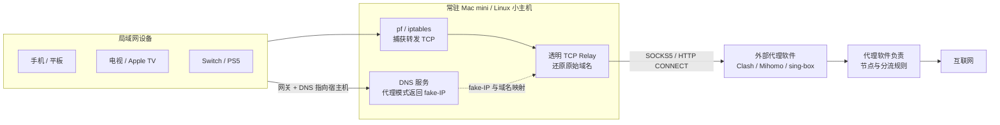
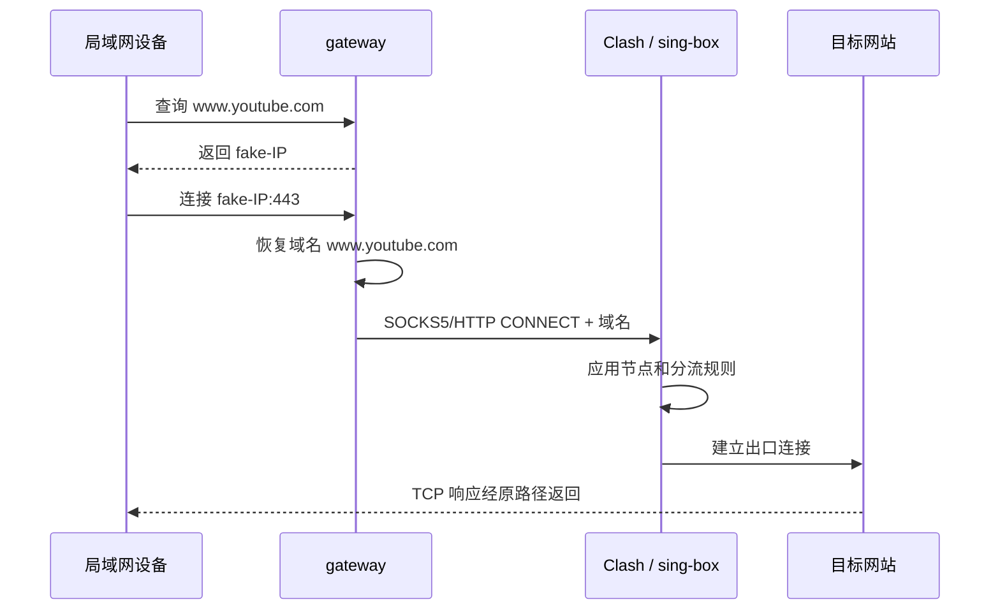

# LAN Proxy Gateway

[](https://github.com/Tght1211/lan-proxy-gateway/releases)
[](https://go.dev/)
[]()
[](LICENSE)

把常驻的 macOS/Linux 电脑变成局域网旁路由，并在 macOS 上管理本机系统代理。典型宿主机是低功耗 Mac mini 或迷你 Linux 主机，且本机或局域网内已有 Clash/sing-box 等代理服务。

项目只保留两条主线：

- **旁路由**：LAN 设备把网关和 DNS 指向本机，TCP 流量可直连或转发到一个 HTTP/SOCKS5 上游。
- **macOS 系统代理**：开启或关闭系统 HTTP+HTTPS / SOCKS5 代理。

需要 VLESS、Trojan、订阅或规则分流时，请在本机运行 Clash、Mihomo 或 sing-box，再把它的 HTTP/SOCKS5 端口配置为上游。本项目不实现这些协议，也不管理节点和订阅。

**是否能访问特定外网，完全取决于所配置的代理服务和节点。gateway 本身不提供代理线路。** 启用系统代理时，旁路由设备会复用同一个代理地址，流量规则全部由代理软件处理。

English: [README_EN.md](README_EN.md)

## 适合谁

适合：

- 有一台长期在线、低功耗的 Mac mini 或迷你 Linux 主机。
- 已经运行 Clash、Mihomo、sing-box，或局域网内已有可用的 HTTP/SOCKS5 代理端点。
- 希望手机、电视、游戏机等设备只改网关和 DNS，就复用同一个代理软件出口。
- 希望网关程序只负责稳定转发，不重复管理订阅、节点和规则。

不适合：

- 希望项目自身提供代理线路、订阅解析、节点选择或规则分流。
- 希望部署在 Windows、普通路由器或 OpenWrt 上。
- 需要代理游戏、语音、STUN 等通用 UDP 流量，或需要 IPv6 透明代理。

## 工作流程


```mermaid
flowchart LR
    subgraph LAN[局域网设备]
        PHONE[手机 / 平板]
        TV[电视 / Apple TV]
        GAME[Switch / PS5]
    end

    subgraph HOST[常驻 Mac mini / Linux 小主机]
        DNS[DNS 服务<br/>代理模式返回 fake-IP]
        FW[pf / iptables<br/>捕获转发 TCP]
        RELAY[透明 TCP Relay<br/>还原原始域名]
    end

    PROXY[外部代理软件<br/>Clash / Mihomo / sing-box]
    RULES[代理软件负责<br/>节点与分流规则]
    NET[互联网]

    LAN -->|网关 + DNS 指向宿主机| DNS
    LAN --> FW --> RELAY
    DNS -. fake-IP 与域名映射 .-> RELAY
    RELAY -->|SOCKS5 / HTTP CONNECT| PROXY
    PROXY --> RULES --> NET
```


```mermaid
sequenceDiagram
    participant D as 局域网设备
    participant G as gateway
    participant P as Clash / sing-box
    participant I as 目标网站

    D->>G: 查询 www.youtube.com
    G-->>D: 返回 fake-IP
    D->>G: 连接 fake-IP:443
    G->>G: 恢复域名 www.youtube.com
    G->>P: SOCKS5/HTTP CONNECT + 域名
    P->>P: 应用节点和分流规则
    P->>I: 建立出口连接
    I-->>D: TCP 响应经原路径返回
```

gateway 不提供代理线路，也不判断哪些网站应该走哪个节点；它只确保局域网 TCP 和原始域名可靠地交给现有代理软件。代理模式会拒绝 QUIC（UDP/443），让客户端立即回退到可被代理的 TCP；项目及外部代理均不要求开启 TUN。

## 实际效果

同一上游代理下，PC 直接使用第三方代理约为 `320 Mbps`，局域网手机经 gateway 测得约 `400 Mbps`。测速会随时段和节点波动，这组结果用于说明 gateway 没有形成固定的带宽上限；它不表示 gateway 能让物理网络变快。

| PC 直接使用第三方代理 | 手机经 LAN gateway 使用同一代理 |
|---|---|
|  |  |

Switch 只需把网关和 DNS 指向运行 gateway 的主机，即可复用同一 SOCKS5/HTTP 代理。下面是实际设备接入后的连接测试：下载约 `72.0 Mbps`、上传约 `8.9 Mbps`。


配置代理出口后，Switch 可直接访问 YouTube；当外部代理节点对 Nintendo 下载源线路更好时，游戏下载速度也会有明显改善。


实际速度、NAT 类型和内容可用性取决于 Wi-Fi、运营商、外部代理软件、节点及其分流规则；gateway 本身不提供线路或流媒体解锁能力。

## 从 v3 升级到 v4

v4 是完整重构，不是兼容性小升级。执行 `gateway update` 前请注意：

- mihomo 内核、订阅、节点、规则集、WebUI、旧终端面板和 Windows 支持均已移除。
- 旧 `gateway.yaml` 会备份为 `gateway.yaml.pre-v4.bak*`，首次运行 v4 时需要重新初始化。
- 代理线路、节点和分流规则必须迁移到独立运行的 Clash、Mihomo 或 sing-box。
- 建议先备份 `~/.config/lan-proxy-gateway/`，确认第三方代理的 HTTP/SOCKS5 地址和端口。

```bash
gateway update
```

更新命令会显示上述迁移说明，并在确认前保持旧版本不变。

## 安装

```bash
curl -fsSL https://raw.githubusercontent.com/Tght1211/lan-proxy-gateway/main/install.sh | bash
```

也可以从源码构建：

```bash
make build
sudo make install
```

## 终端控制面板

```bash
sudo gateway
```

```text
1  启动/停止旁路由（按当前状态直接执行）
2  设置代理（SOCKS5 / HTTP / 直连）
3  查看设备参数
4  查看最近日志
Q  退出
```

启动旁路由需要管理员权限；控制面板会给出对应的 `sudo gateway start` 提示。系统代理通过 macOS `networksetup` 配置，并同步为旁路由的上游出口。

## 旁路由

首次初始化并启动：

```bash
sudo gateway install
```

也可分步执行：

```bash
sudo gateway start
gateway status
sudo gateway stop
```

设置 LAN 设备网络参数：

| 项目 | 值 |
|---|---|
| IP 地址 | 当前局域网内未占用的静态地址 |
| 网关 / 路由器 | 运行 gateway 的电脑局域网 IP |
| DNS 1 | 与网关相同 |
| DNS 2 | 留空；设备强制要求时填 DNS 1 |

Android/ColorOS 还应关闭“私人 DNS”。代理模式使用 fake-IP 保留域名，让 Clash/sing-box 负责解析和规则匹配；默认不劫持设备发往其他 DNS 的查询，避免部分 Android/ColorOS 浏览器异常。

启用系统代理后，旁路由的 TCP 也会转发到同一代理端口。UDP/443 会被拒绝以促使浏览器回退到 TCP，其他 UDP 仍直连。整个方案不需要 gateway 或第三方代理开启 TUN。

## macOS 系统代理

```bash
gateway system-proxy status
gateway system-proxy on --type socks5 --host 127.0.0.1 --port 7897
gateway system-proxy on --type http --host 127.0.0.1 --port 7897
gateway system-proxy off
```

`http` 模式同时配置 HTTP 和 HTTPS Web Proxy；`socks5` 模式配置 SOCKS Firewall Proxy。启用一种模式时会关闭另一种模式，并同步旁路由出口；执行 `off` 时旁路由切回直连。

## 常用命令

```bash
sudo gateway                    # 控制面板（启停和 macOS 代理需要管理员权限）
sudo gateway install            # 初始化、启动、可选开机自启
sudo gateway start|stop|restart
gateway status [--json]
gateway system-proxy status [--json]
gateway system-proxy on --type socks5|http --host HOST --port PORT
gateway system-proxy off
gateway service install|uninstall|status
gateway update [version]         # 完整重构迁移，执行前会提示确认
```

详细命令见 [docs/commands.md](docs/commands.md)，实现结构见 [docs/architecture.md](docs/architecture.md)。

## 范围

- 旁路由支持 macOS 和 Linux，IPv4 TCP 为主。
- macOS 使用 pf，Linux 使用 iptables。
- 当前只支持 macOS 和 Linux，不提供 Windows 构建。
- 不以普通路由器/OpenWrt 为部署目标；宿主机应是完整、常驻的电脑系统。
- 不提供订阅、节点、规则集、WebUI、流量图表、UDP 代理和 TUN 模式。

## License

[MIT](LICENSE) © 2025-2026 [Tght1211](https://github.com/Tght1211)

## Star History

[](https://star-history.com/#Tght1211/lan-proxy-gateway&Date)
