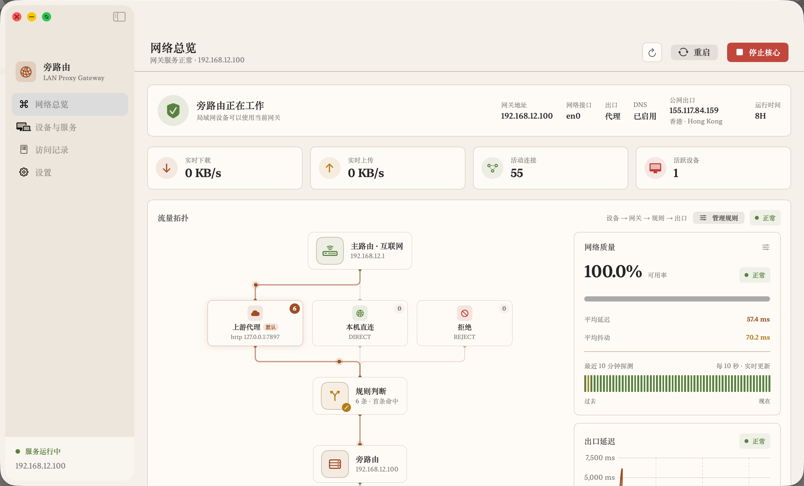
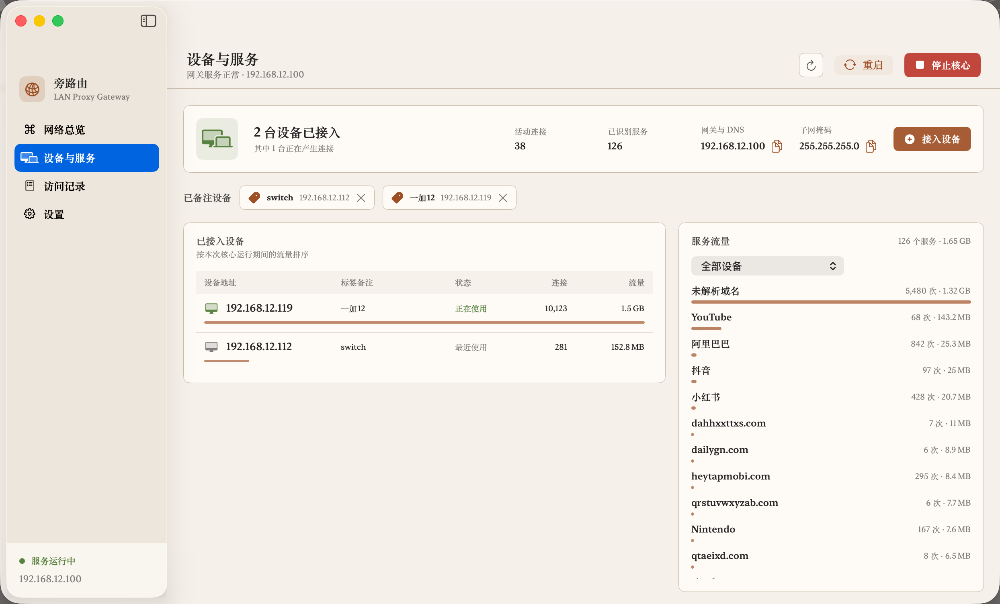
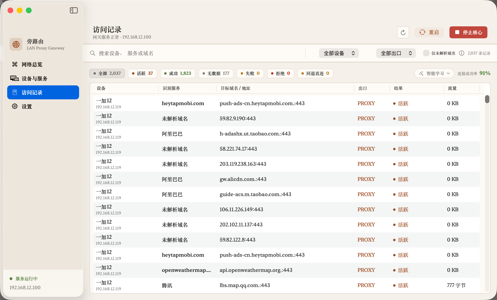
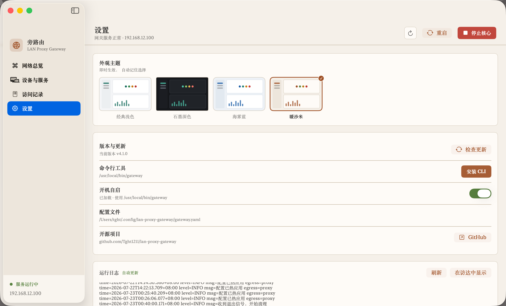

# LAN Proxy Gateway

[](https://github.com/Tght1211/lan-proxy-gateway/releases/latest)
[](https://go.dev/)
[]()
[](LICENSE)

把常驻的 Mac mini 或 Linux 小主机变成局域网旁路由。Switch、PS5、Apple TV、手机和电视不必安装代理 App，只需把网关和 DNS 指向这台电脑，即可复用已有的 Clash、Mihomo、sing-box 或其他 HTTP/SOCKS5 代理。

> [!IMPORTANT]
> 本项目不提供代理节点、订阅或流媒体解锁。能否访问特定服务取决于你配置的代理软件和节点。

[English](README_EN.md) · [下载最新版](https://github.com/Tght1211/lan-proxy-gateway/releases/latest) · [完整文档](docs/README.md)

<p align="center">
  
  
  
  
</p>

## 核心能力

- **LAN 旁路由**：接管局域网设备的 IPv4 TCP 流量，出口可直连或转发到一个 HTTP/SOCKS5 上游。
- **原始域名转发**：代理模式使用 fake-IP 保存域名，让 Clash/sing-box 继续按域名分流；无需开启 TUN。
- **轻量分流**：按域名、域名后缀或 IP-CIDR 选择代理、直连或拒绝，并支持代理失败后的直连回退学习。
- **原生 macOS App**：查看流量拓扑、设备与服务、连接结果和网络质量，也可管理规则、代理与核心状态。
- **系统级集成**：macOS 使用 `pf`，Linux 使用 `iptables`；停止服务时会清理规则并恢复由程序修改的系统状态。

它适合有一台长期在线电脑、且已经拥有代理软件或 HTTP/SOCKS5 端点的用户。不适合 Windows、普通路由器/OpenWrt、IPv6 透明代理或需要代理游戏/语音 UDP 的场景。代理模式会拒绝 QUIC（UDP/443）以促使客户端回退 TCP，其他 UDP 仍直连。

## 快速开始

### 1. 安装

macOS 用户推荐从 [GitHub Releases](https://github.com/Tght1211/lan-proxy-gateway/releases/latest) 下载 DMG。App 与 CLI 使用同一个 `gateway` 核心，首次打开后按引导配置即可。

macOS / Linux 也可以安装 CLI：

```bash
curl -fsSL https://raw.githubusercontent.com/Tght1211/lan-proxy-gateway/main/install.sh | bash
sudo gateway install
```

`sudo` 用于监听 DNS 端口、启用 IP 转发和配置防火墙。安装为系统服务后，日常查看状态与修改配置不需要一直使用 `sudo`。

### 2. 配置出口

在 App 中设置代理，或运行 `sudo gateway` 后选择“设置代理”。同机代理常见写法如下，实际端口以你的代理软件为准：

```text
类型  HTTP
地址  127.0.0.1
端口  7897
```

也可以先使用直连出口，单纯把电脑作为局域网网关。

### 3. 接入设备

运行 `gateway status`，按输出在手机、电视或游戏机中填写：

| 设备设置 | 填写内容 |
|---|---|
| IP 设置 | 手动 / 静态 |
| IP 地址 | 同网段且未占用的地址；每台设备不同 |
| 子网掩码 | `255.255.255.0`；Android 前缀长度通常为 `24` |
| 网关 / 路由器 | 运行 gateway 的电脑 IP |
| DNS 1 | 运行 gateway 的电脑 IP |
| DNS 2 | 同上；设备不允许重复时留空 |
| 设备代理 | 无 / 不使用 |

保存后重新连接 Wi-Fi，再运行一次 `gateway status` 确认服务状态。只有“设备 IP”属于手机或游戏机自身；网关和 DNS 都填运行 gateway 的电脑 IP。

[查看各设备的图文步骤](docs/device-setup.md) · [查看故障排查](docs/faq.md)

## 文档

| 内容 | 链接 |
|---|---|
| 设备接入 | [总览](docs/device-setup.md) · [手机](docs/phone-setup.md) · [Switch](docs/switch-setup.md) · [PS5](docs/ps5-setup.md) · [Apple TV](docs/appletv-setup.md) · [电视](docs/tv-setup.md) |
| 使用与配置 | [macOS App](docs/app.md) · [命令说明](docs/commands.md) · [配置文件](docs/advanced.md) · [典型场景](docs/scenarios.md) |
| 了解项目 | [工作原理](docs/architecture.md) · [实机结果](docs/real-device-results.md) · [常见问题](docs/faq.md) |
| 升级与自动化 | [从 v3 升级](docs/migration-v4.md) · [交给 AI 配置](docs/ai-setup.md) · [Changelog](CHANGELOG.md) |

完整入口见 [docs/README.md](docs/README.md)。

## 从源码构建

```bash
make build       # CLI
make test        # Go 测试
make build-app   # macOS App
```

App 打包与项目结构见 [App 文档](docs/app.md) 和 [架构说明](docs/architecture.md)。

## License

[MIT](LICENSE) © 2025-2026 [Tght1211](https://github.com/Tght1211)
