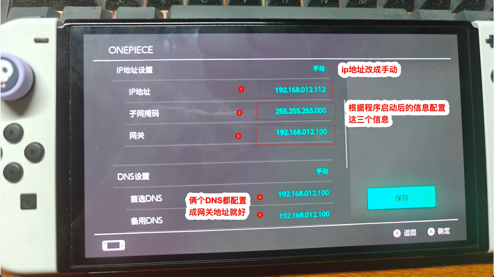
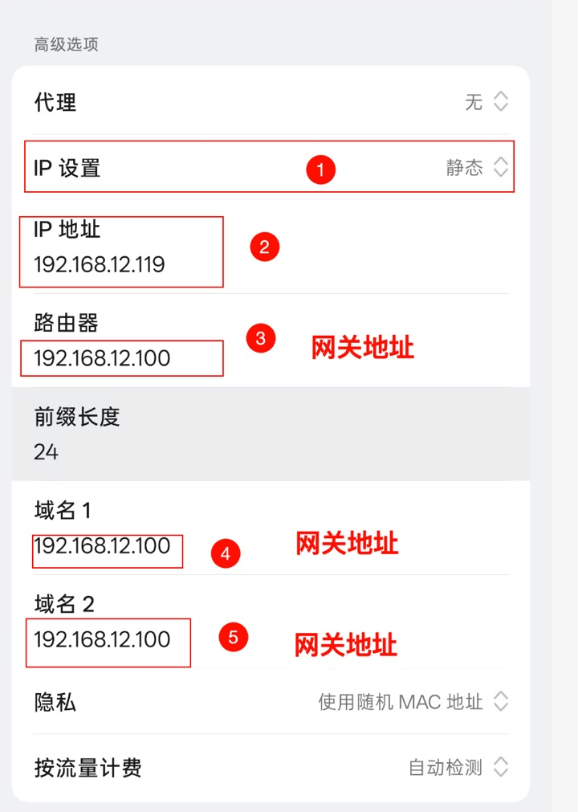
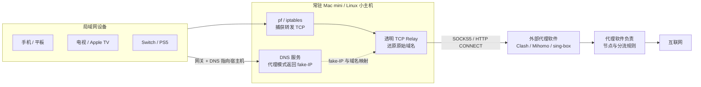
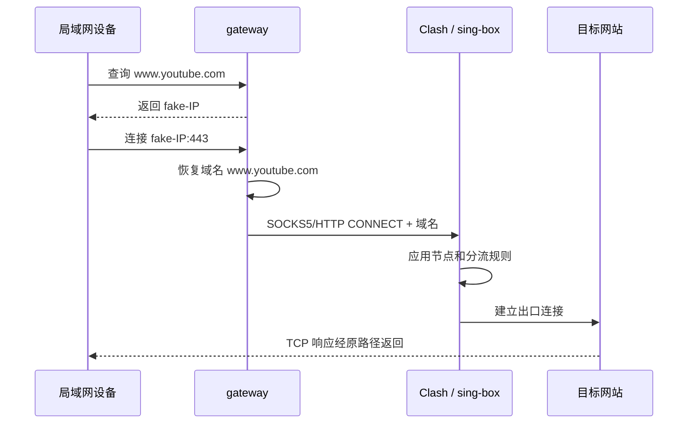
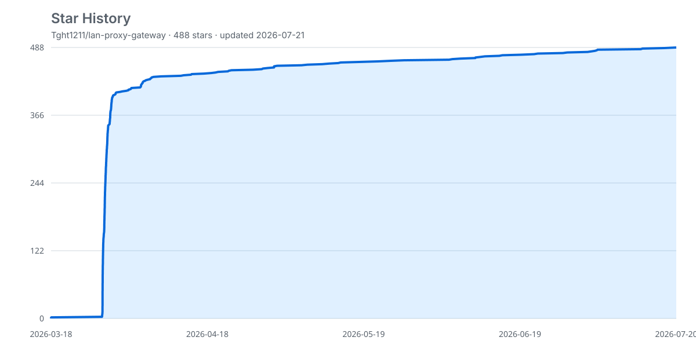

# LAN Proxy Gateway

[](https://github.com/Tght1211/lan-proxy-gateway/releases)
[](https://go.dev/)
[]()
[](LICENSE)

把 Mac mini 或 Linux 小主机变成旁路由，让 Switch、PS5、Apple TV、iPhone 等局域网设备无需安装代理 App，只需配置静态 IP、网关和 DNS，即可共享现有 Clash/sing-box 代理。

本项目面向长期在线的低功耗电脑，并支持在 macOS 上管理本机系统代理。它不提供代理线路，而是复用本机或局域网中已有的 Clash、Mihomo、sing-box 等代理服务。

项目只保留两条主线：

- **旁路由**：LAN 设备把网关和 DNS 指向本机，TCP 流量可直连或转发到一个 HTTP/SOCKS5 上游。
- **macOS 系统代理**：开启或关闭系统 HTTP+HTTPS / SOCKS5 代理。

需要 VLESS、Trojan、订阅或规则分流时，请在本机运行 Clash、Mihomo 或 sing-box，再把它的 HTTP/SOCKS5 端口配置为上游。本项目不实现这些协议，也不管理节点和订阅。

**是否能访问特定外网，完全取决于所配置的代理服务和节点。gateway 本身不提供代理线路。** 启用系统代理时，旁路由设备会复用同一个代理地址，流量规则全部由代理软件处理。

English: [README_EN.md](README_EN.md)

## 目录

- [快速入门](#快速入门)
- [复制给 AI 自动配置](#复制给-ai-自动配置)
- [适合谁](#适合谁)
- [工作流程](#工作流程)
- [实际效果](#实际效果)
- [从 v3 升级到 v4](#从-v3-升级到-v4)
- [终端控制面板](#终端控制面板)
- [macOS 系统代理](#macos-系统代理)
- [常用命令](#常用命令)

## 快速入门

### 1. 开始前准备

你需要：

- 一台与其他设备连接同一路由器、可以长期在线的 **macOS 或 Linux 电脑**，推荐 Mac mini 或低功耗 Linux 小主机。
- 一个已经能正常使用的代理软件，例如 Clash Verge、Mihomo Party 或 sing-box。gateway 不提供代理节点或订阅。
- 代理软件提供的 **协议、地址和端口**。gateway 支持 `HTTP` 或 `SOCKS5` 上游。

如果代理软件和 gateway 就在同一台电脑上，代理地址通常填 `127.0.0.1`。以 Clash Verge 的 Mixed Port 为例，常见组合是 `127.0.0.1:7897`，但 **端口必须以你自己的代理软件界面为准**。如果代理软件运行在另一台局域网电脑上，地址应填那台电脑的局域网 IP，并确保它允许局域网连接。

### 2. 安装并启动

```bash
curl -fsSL https://raw.githubusercontent.com/Tght1211/lan-proxy-gateway/main/install.sh | bash
sudo gateway install
```

也可以从源码构建：

```bash
make build
sudo make install
```

启动后执行下面的命令，程序会按设备设置页面的字段打印实际参数：

```bash
gateway status
```

示例（你的地址可能不同，以终端实际输出为准）：

```text
设备网络设置（照设备页面逐项填写）
  IP 地址设置               手动 / 静态
  IP 地址（设备自身，推荐）  192.168.12.112（确认未占用）
  子网掩码                  255.255.255.0
  前缀长度（Android）        24
  网关 / 路由器             192.168.12.100
  DNS 设置                  手动
  首选 DNS                  192.168.12.100
  备用 DNS                  192.168.12.100（设备不允许重复时留空）
  代理                      无 / 不使用
  私人 DNS（Android）        关闭 / 自动
```

### 3. 在手机、Switch 或电视上填写

先记住两个概念：

- **设备 IP** 是手机、Switch 自己的地址，每台设备必须不同。可以先用终端给出的推荐值，但要确认没有被占用，最好在路由器中为设备固定该地址。
- **网关和 DNS** 都是运行 gateway 的电脑地址。下面示例中三项都填 `192.168.12.100`。

| 设备页面里的字段 | 示例值 | 怎么理解 |
|---|---:|---|
| IP 设置 | 手动 / 静态 | 不再使用 DHCP 自动填写 |
| IP 地址 | `192.168.12.112` | 设备自己的地址；每台设备不同 |
| 子网掩码 | `255.255.255.0` | Android 显示为“前缀长度”时填 `24` |
| 网关 / 路由器 | `192.168.12.100` | gateway 电脑的地址 |
| DNS 1 / 首选 DNS | `192.168.12.100` | 与网关相同 |
| DNS 2 / 备用 DNS | `192.168.12.100` | 与网关相同；不允许重复时留空 |
| 代理 | 无 / 不使用 | 不在手机或游戏机上填写代理端口 |

#### Nintendo Switch 示例



#### Android 手机示例

Android 将“子网掩码”显示为“前缀长度”，填写 `24`。还应把系统的“私人 DNS”设为关闭或自动。



更细的步骤见 [设备接入总览](docs/device-setup.md)、[手机教程](docs/phone-setup.md)、[Switch 教程](docs/switch-setup.md)、[PS5 教程](docs/ps5-setup.md)、[Apple TV 教程](docs/appletv-setup.md) 和 [电视教程](docs/tv-setup.md)。

### 4. 配置代理出口

运行 `sudo gateway`，选择 `2 设置代理`，依次选择 `SOCKS5` 或 `HTTP`，再输入代理地址和端口。同机 Clash Verge 的常见示例是：

```text
类型  HTTP
地址  127.0.0.1
端口  7897
```

也可以直接执行：

```bash
gateway system-proxy on --type http --host 127.0.0.1 --port 7897
```

macOS 会同时配置本机系统代理和 LAN 出口；Linux 只配置 LAN 出口。代理协议和端口必须与代理软件实际监听值一致。

### 5. 验证

```bash
gateway status
```

然后关闭测试设备的移动数据，重新连接 Wi-Fi，再打开网页或 App。失败时先确认 gateway 为运行状态，再核对设备 IP、网关、DNS 和代理软件端口。

## 复制给 AI 自动配置

在 Codex、Claude Code 等能够操作本机终端的 AI 工具中，进入本项目目录后复制下面整段 Prompt。AI 可以完成电脑端的检查、安装和启动，并打印手机/Switch 要填的值；设备设置页面仍需你照着填写。遇到 `sudo` 密码时需要你本人输入。

```text
请帮我在当前 macOS 或 Linux 电脑上配置 LAN Proxy Gateway。先阅读 README.md 和项目命令帮助，再执行操作，不要臆造命令。

我的目标：让同一局域网里的手机、Switch、电视把网关和 DNS 指向这台电脑，并复用现有代理软件。不要启用 TUN，不要安装或修改代理节点、订阅和分流规则。

请按顺序完成：
1. 检查操作系统、当前局域网 IPv4、默认路由、项目状态和 gateway 是否已安装。
2. 如未安装，从当前仓库构建并安装；需要 sudo 时暂停让我输入密码。不要删除现有配置，任何破坏性操作先询问。
3. 初始化并启动 gateway，确认服务、DNS 端口和转发状态正常。
4. 检查本机代理软件实际监听的 HTTP 或 SOCKS5 地址和端口。常见示例是 HTTP 127.0.0.1:7897，但必须以本机实际监听为准；无法确定时先问我。
5. 把确认后的代理配置为 gateway 的 LAN 出口；macOS 同时配置系统代理，Linux 只配置 LAN 出口。
6. 运行 gateway status，并在最后单独输出一份“小白填写清单”：IP 设置、推荐设备 IP、子网掩码、Android 前缀长度、网关/路由器、DNS 设置、首选 DNS、备用 DNS、代理、Android 私人 DNS。明确指出只有设备 IP 每台不同，网关和 DNS 都填 gateway 电脑 IP。
7. 做只读连通性检查并汇报结果。不要替我修改手机、Switch、电视或路由器设置。
```

## 适合谁

适合：

- 有一台长期在线、低功耗的 Mac mini 或迷你 Linux 主机。
- 已经运行 Clash、Mihomo、sing-box，或局域网内已有可用的 HTTP/SOCKS5 代理端点。
- 希望手机、电视、游戏机等设备只改网关和 DNS，就复用同一个代理软件出口。
- 希望网关程序只负责稳定转发，不重复管理订阅、节点和规则。

不适合：

- 希望项目自身提供代理线路、订阅解析、节点选择或规则分流。
- 希望部署在 Windows、普通路由器或 OpenWrt 上。
- 需要代理游戏、语音、STUN 等通用 UDP 流量，或需要 IPv6 透明代理。

## 工作流程


```mermaid
flowchart LR
    subgraph LAN[局域网设备]
        PHONE[手机 / 平板]
        TV[电视 / Apple TV]
        GAME[Switch / PS5]
    end

    subgraph HOST[常驻 Mac mini / Linux 小主机]
        DNS[DNS 服务<br/>代理模式返回 fake-IP]
        FW[pf / iptables<br/>捕获转发 TCP]
        RELAY[透明 TCP Relay<br/>还原原始域名]
    end

    PROXY[外部代理软件<br/>Clash / Mihomo / sing-box]
    RULES[代理软件负责<br/>节点与分流规则]
    NET[互联网]

    LAN -->|网关 + DNS 指向宿主机| DNS
    LAN --> FW --> RELAY
    DNS -. fake-IP 与域名映射 .-> RELAY
    RELAY -->|SOCKS5 / HTTP CONNECT| PROXY
    PROXY --> RULES --> NET
```


```mermaid
sequenceDiagram
    participant D as 局域网设备
    participant G as gateway
    participant P as Clash / sing-box
    participant I as 目标网站

    D->>G: 查询 www.youtube.com
    G-->>D: 返回 fake-IP
    D->>G: 连接 fake-IP:443
    G->>G: 恢复域名 www.youtube.com
    G->>P: SOCKS5/HTTP CONNECT + 域名
    P->>P: 应用节点和分流规则
    P->>I: 建立出口连接
    I-->>D: TCP 响应经原路径返回
```

gateway 不提供代理线路，也不判断哪些网站应该走哪个节点；它只确保局域网 TCP 和原始域名可靠地交给现有代理软件。代理模式会拒绝 QUIC（UDP/443），让客户端立即回退到可被代理的 TCP；项目及外部代理均不要求开启 TUN。

## 实际效果

同一上游代理下，PC 直接使用第三方代理约为 `320 Mbps`，局域网手机经 gateway 测得约 `400 Mbps`。测速会随时段和节点波动，这组结果用于说明 gateway 没有形成固定的带宽上限；它不表示 gateway 能让物理网络变快。

| PC 直接使用第三方代理 | 手机经 LAN gateway 使用同一代理 |
|---|---|
|  |  |

Switch 只需把网关和 DNS 指向运行 gateway 的主机，即可复用同一 SOCKS5/HTTP 代理。下面是实际设备接入后的连接测试：下载约 `72.0 Mbps`、上传约 `8.9 Mbps`。


配置代理出口后，Switch 可直接访问 YouTube；当外部代理节点对 Nintendo 下载源线路更好时，游戏下载速度也会有明显改善。


实际速度、NAT 类型和内容可用性取决于 Wi-Fi、运营商、外部代理软件、节点及其分流规则；gateway 本身不提供线路或流媒体解锁能力。

## 从 v3 升级到 v4

v4 是完整重构，不是兼容性小升级。执行 `gateway update` 前请注意：

- mihomo 内核、订阅、节点、规则集、WebUI、旧终端面板和 Windows 支持均已移除。
- 旧 `gateway.yaml` 会备份为 `gateway.yaml.pre-v4.bak*`，首次运行 v4 时需要重新初始化。
- 代理线路、节点和分流规则必须迁移到独立运行的 Clash、Mihomo 或 sing-box。
- 建议先备份 `~/.config/lan-proxy-gateway/`，确认第三方代理的 HTTP/SOCKS5 地址和端口。

```bash
gateway update
```

更新命令会显示上述迁移说明，并在确认前保持旧版本不变。

## 终端控制面板

```bash
sudo gateway
```

```text
1  启动/停止旁路由（按当前状态直接执行）
2  设置代理（SOCKS5 / HTTP / 直连）
3  查看设备参数
4  查看最近日志
Q  退出
```

启动旁路由需要管理员权限；控制面板会给出对应的 `sudo gateway start` 提示。系统代理通过 macOS `networksetup` 配置，并同步为旁路由的上游出口。

## macOS 系统代理

```bash
gateway system-proxy status
gateway system-proxy on --type socks5 --host 127.0.0.1 --port 7897
gateway system-proxy on --type http --host 127.0.0.1 --port 7897
gateway system-proxy off
```

`http` 模式同时配置 HTTP 和 HTTPS Web Proxy；`socks5` 模式配置 SOCKS Firewall Proxy。启用一种模式时会关闭另一种模式，并同步旁路由出口；执行 `off` 时旁路由切回直连。

## 常用命令

```bash
sudo gateway                    # 控制面板（启停和 macOS 代理需要管理员权限）
sudo gateway install            # 初始化、启动、可选开机自启
sudo gateway start|stop|restart
gateway status [--json]
gateway system-proxy status [--json]
gateway system-proxy on --type socks5|http --host HOST --port PORT
gateway system-proxy off
gateway service install|uninstall|status
gateway update [version]         # 完整重构迁移，执行前会提示确认
```

详细命令见 [docs/commands.md](docs/commands.md)，实现结构见 [docs/architecture.md](docs/architecture.md)。

## 范围

- 旁路由支持 macOS 和 Linux，IPv4 TCP 为主。
- macOS 使用 pf，Linux 使用 iptables。
- 当前只支持 macOS 和 Linux，不提供 Windows 构建。
- 不以普通路由器/OpenWrt 为部署目标；宿主机应是完整、常驻的电脑系统。
- 不提供订阅、节点、规则集、WebUI、流量图表、UDP 代理和 TUN 模式。

## License

[MIT](LICENSE) © 2025-2026 [Tght1211](https://github.com/Tght1211)

## Star History

[](https://star-history.com/#Tght1211/lan-proxy-gateway&Date)

[查看在线 Star History](https://star-history.com/#Tght1211/lan-proxy-gateway&Date)。README 内使用 GitHub Stargazer 数据生成的仓库内曲线图，避免第三方图片接口异常时显示破图。
