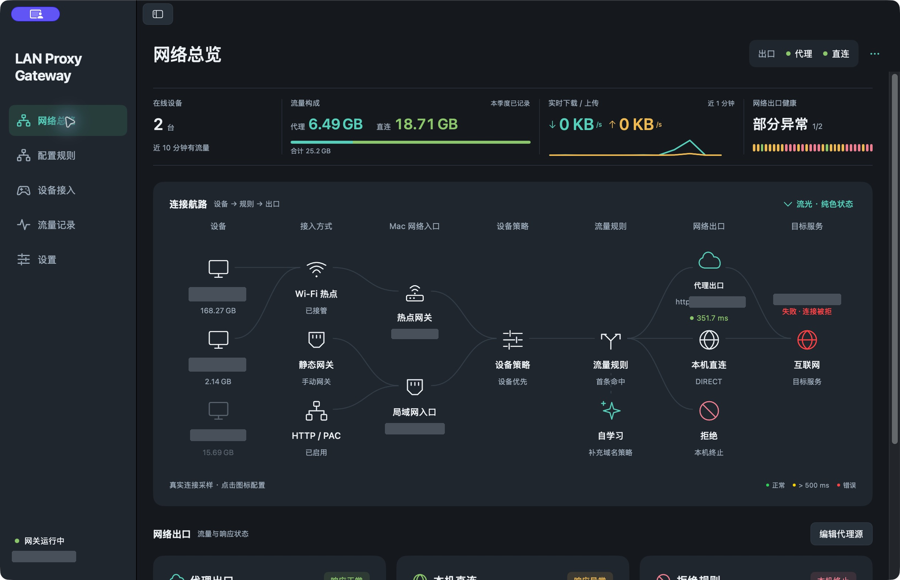
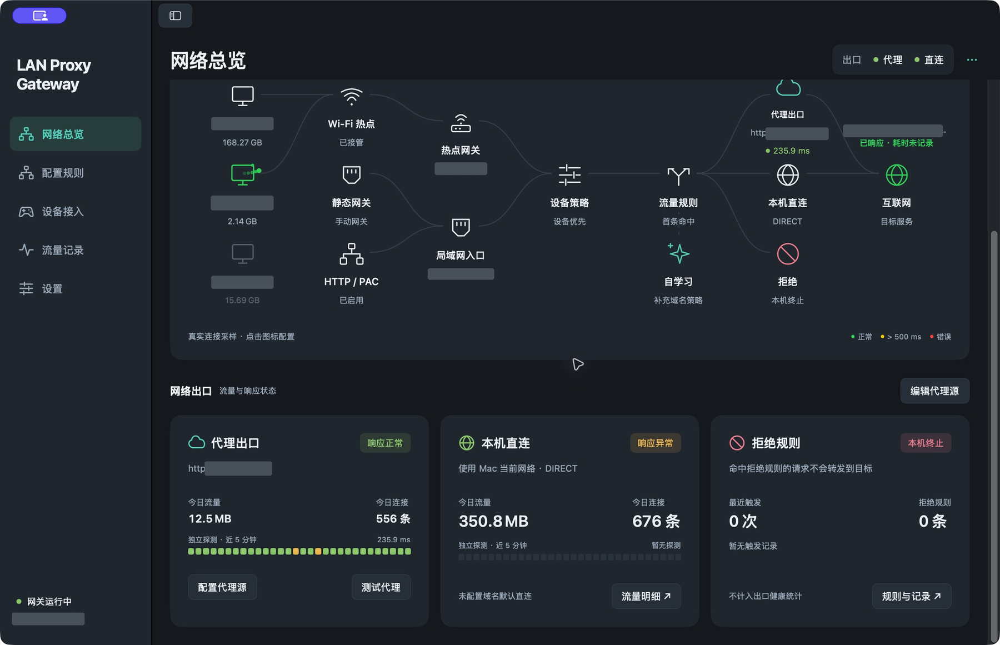
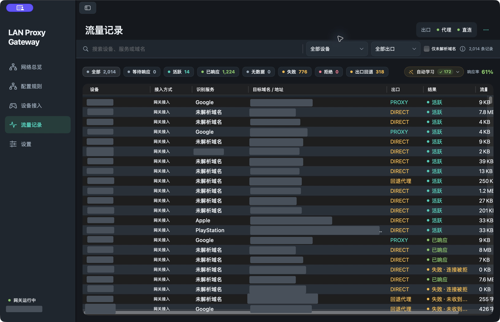
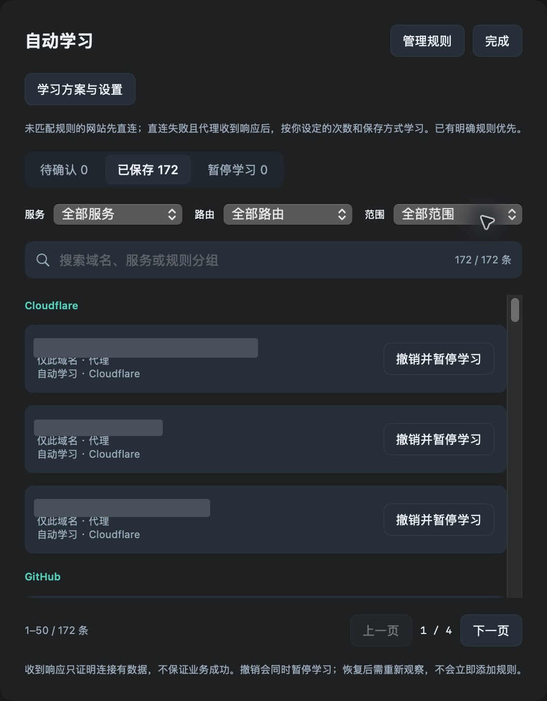
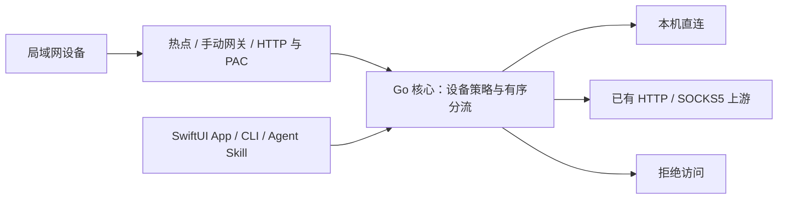

# LAN Proxy Gateway

[](https://github.com/Tght1211/lan-proxy-gateway/releases/latest)
[](https://go.dev/)
[](LICENSE)

**把已有代理共享给局域网设备。** 有线联网的 Mac 可以通过 Wi-Fi 热点，让 PS5、Switch、Apple TV 和手机接入；Mac / Linux 也支持手动网关，遵循代理设置的客户端还可使用 HTTP / PAC。

[下载最新版](https://github.com/Tght1211/lan-proxy-gateway/releases/latest) · [English](README_EN.md) · [完整文档](docs/README.md)

> 本项目不提供代理节点或订阅。你需要已有的 Clash、Mihomo、sing-box 或 HTTP/SOCKS5 端点；服务可用性取决于上游代理与目标网站。

## 软件界面



首页支持上下滚动：顶部查看关键指标，中间查看连接拓扑，下方查看出口卡片（最多三列）。出口不再是独立菜单。季度流量区分已记录的代理与直连；出口健康是全局摘要，具体异常查看各出口卡片。

v4.5.2：本机直连独立探测百度并记录历史，不借用代理结果；拓扑图标和文字都可点击。配置规则按全部 / 代理 / 直连 / 拒绝筛选，不再区分资产视角。升级后需重启核心，才能启用新版直连探测。

<details>
<summary>更多运行截图：出口卡片、流量记录与分类自学习</summary>
<p align="center">
  
  
</p>
<p align="center"></p>
</details>

截图来自当前软件实机运行，已对地址、访问域名与本机路径做脱敏；数值不是演示数据。

## 能做什么

- **三种接入**：Mac 互联网共享热点、手动网关、HTTP 代理 / PAC；保留 Mac 原有系统代理与 DNS。
- **设备与域名分流**：设备策略优先，支持精确域名、域名后缀和 IP-CIDR；动作是代理、直连或拒绝。
- **自动代理学习**：未匹配目标先直连，失败或满足首响应超时重试条件后再试代理；代理收到响应才积累证据，达到阈值后自动保存或等待确认。明确规则与禁止直连设置优先。
- **大量规则可管理**：自学习按待确认 / 已保存 / 暂停学习分类，再按服务、路由、范围筛选、搜索；每页 50 条，保留旧版直连规则的标识。暂停学习不等于禁止访问。
- **用量与排障**：按设备、接入方式、域名及实际出口记录日汇总；查看代理与直连用量、实时连接、失败和出口健康。
- **外部 AI Agent**：导出可安装的 Skill，通过 CLI 诊断并按用户要求调整配置；无需在 App 中配置模型或 API Key。

## 快速开始

### 1. 下载并配置上游

macOS 下载 [Release 中的 DMG](https://github.com/Tght1211/lan-proxy-gateway/releases/latest)，将 App 拖入“应用程序”。在“网络总览”配置已有代理的实际类型、地址和端口；不要把共享给设备的 HTTP 监听端口当作上游。

macOS / Linux 的 CLI 安装：

```bash
curl -fsSL https://raw.githubusercontent.com/Tght1211/lan-proxy-gateway/main/install.sh | bash
sudo gateway install
```

### 2. 选择接入方式

| 方式 | 主机条件 | 客户端设置 |
|---|---|---|
| **Wi-Fi 热点** | Mac 有线联网，在系统中开启互联网共享，然后在 App 中开启热点接管 | 连接新热点，IP、网关和 DNS 保持自动；无需客户端代理软件 |
| **手动网关** | Mac / Linux 位于同一局域网 | 按实际子网设置未占用的静态 IP，网关与 DNS 指向该电脑 |
| **HTTP / PAC** | 启用 App 的局域网 HTTP 代理，保存端口与认证 | 手动填写服务器和端口，或使用该监听器的 `proxy.pac` URL；无需修改网关 / DNS |

[热点设置](docs/hotspot-setup.md) · [各设备接入步骤](docs/device-setup.md) · [HTTP / PAC 说明](docs/app.md#局域网-http-代理接入)

切换热点 / 手动网关模式需重启核心；重启会中断现有连接。涉及防火墙、系统服务等操作时，系统可能要求管理员授权。

### 3. 查看并调整

“网络总览”查看拓扑与出口，“设备接入”核对设备用量，“流量记录”筛选连接与自学习记录，“配置规则”管理分流，“设置”管理接入、CLI、Agent 和运行选项。页面切换保留已访问页面的筛选与滚动位置。

## 用 AI Agent 控制

在 **设置 → CLI 与 Agent** 导出 Skill ZIP，并复制安装说明交给支持 Skill、可在网关电脑上执行命令的 Agent（例如 Codex）。安装完整的 `lan-proxy-gateway/` 目录；升级软件后重新导出并更新已安装副本。

Skill 内置只读摘要和分类分页工具，避免把数千条规则整份塞进对话；管理 API 保持本机访问并使用独立认证。Agent 先诊断，按用户授权修改，不擅自重启或开放远程管理。

[安装、测试与命令参考](docs/agent-skill.md)

## 边界与统计口径

- 核心支持 **一个 HTTP/SOCKS5 代理上游**；多个出口卡片不表示配置了多个代理节点。
- 不提供 Windows、OpenWrt 或 IPv6 透明代理；HTTP 监听器不承载任意 UDP。代理模式阻止 QUIC（UDP/443）以促使客户端回退 TCP，其他 UDP 仍直连；游戏 NAT 和联机效果需实测。
- 流量只统计经过本网关的转发字节，不包含绕过本网关的流量、Mac 其他应用的代理流量或协议开销，不等同于服务商账单。旧数据缺失出口分类时不能反推代理用量。
- 日汇总持久化保存；逐条连接仅在内存中保留 72 小时、最多 2000 条。收到响应不等于业务成功，不解密 HTTPS。

## 架构与开发


```mermaid
flowchart LR
    Device[局域网设备] --> Access[热点 / 手动网关 / HTTP 与 PAC]
    Access --> Core[Go 核心：设备策略与有序分流]
    Core --> Direct[本机直连]
    Core --> Proxy[已有 HTTP / SOCKS5 上游]
    Core --> Reject[拒绝访问]
    App[SwiftUI App / CLI / Agent Skill] --> Core
```

SwiftUI App 与 CLI 使用同一个核心和配置。macOS 使用 `pf`，Linux 使用 `iptables`；停止服务时恢复由程序修改的状态。

```bash
make build
make test
make build-app
make dmg VERSION=v4.5.2
make skill VERSION=v4.5.2
```

完整 Xcode 或 GitHub macOS Runner 打包 universal App；只有 Command Line Tools 时，SwiftUI 外壳为本机架构。

[App 文档](docs/app.md) · [架构说明](docs/architecture.md) · [故障排查](docs/faq.md) · [Changelog](CHANGELOG.md) · [v4.5.2 更新说明](docs/releases/v4.5.2.md)

## License

[MIT](LICENSE)
