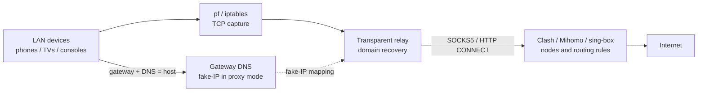
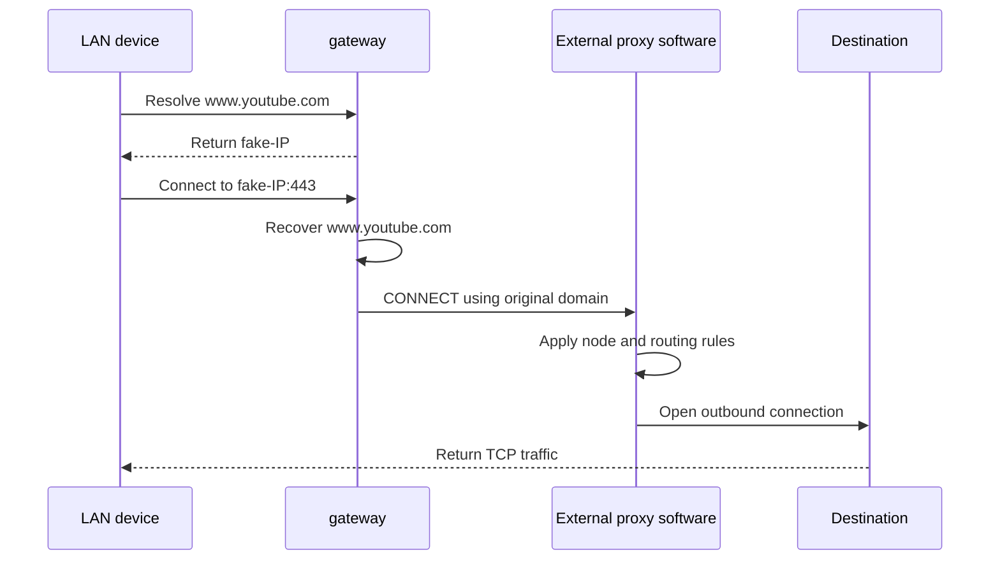

# LAN Proxy Gateway

[](https://github.com/Tght1211/lan-proxy-gateway/releases)
[](https://go.dev/)
[]()
[](LICENSE)

Turn an always-on macOS/Linux computer into a LAN bypass gateway, and manage the host's macOS system proxy. The intended hosts are low-power Mac mini and small Linux computers with an existing Clash/sing-box service locally or elsewhere on the LAN.

The project intentionally has two responsibilities:

- **LAN gateway:** devices point their gateway and DNS at this host; TCP exits directly or through one HTTP/SOCKS5 upstream.
- **macOS system proxy:** enable or disable the host's HTTP+HTTPS or SOCKS5 proxy settings.

Run Clash, Mihomo, or sing-box separately for VLESS, subscriptions, node selection, and routing rules, then configure its local HTTP/SOCKS5 port as the upstream.

Access to a particular external site depends entirely on that proxy service and its selected node. Gateway provides no proxy nodes. Enabling the macOS system proxy also makes LAN gateway traffic use the same proxy endpoint.

中文: [README.md](README.md)

## Intended audience

This project is for users who:

- keep a low-power Mac mini or small Linux computer online;
- already run Clash, Mihomo, or sing-box, or have a reachable HTTP/SOCKS5 endpoint on the LAN;
- want phones, TVs, and consoles to reuse that proxy software by changing only gateway and DNS settings;
- prefer a focused gateway that does not duplicate subscriptions, nodes, or routing rules.

It is not intended for Windows, consumer routers/OpenWrt, built-in proxy services, UDP proxying, or IPv6 transparent routing.

## How it works





## Upgrading from v3 to v4

v4 is a complete rewrite rather than an in-place compatible update. The bundled mihomo engine, subscriptions, nodes, rule sets, WebUI, old dashboard, and Windows build have been removed. Existing configuration is backed up and v4 requires initialization again. Move all proxy nodes and routing rules to a separately running Clash, Mihomo, or sing-box service before running `gateway update`.

## Install

```bash
curl -fsSL https://raw.githubusercontent.com/Tght1211/lan-proxy-gateway/main/install.sh | bash
```

Or build locally:

```bash
make build
sudo make install
```

## Terminal control panel

Run `sudo gateway` to open the focused control panel (gateway lifecycle and macOS proxy changes require administrator privileges):

```text
1  Start/stop gateway (one action based on current state)
2  Set proxy (SOCKS5 / HTTP / direct)
3  Show device settings
4  Show recent logs
Q  Exit
```

## LAN gateway

```bash
sudo gateway install
sudo gateway start
gateway status

```

On each LAN device, set both Gateway/Router and DNS 1 to the gateway host's LAN IPv4 address. Leave DNS 2 empty. Disable Private DNS on Android/ColorOS.

Proxy mode uses fake-IP so the relay can pass original domains to Clash/sing-box for resolution and rule matching. DNS queries sent to other resolvers are not hijacked. UDP/443 is rejected so browsers fall back to TCP, while other UDP remains direct.

## macOS system proxy

```bash
gateway system-proxy status
gateway system-proxy on --type socks5 --host 127.0.0.1 --port 7897
gateway system-proxy on --type http --host 127.0.0.1 --port 7897
gateway system-proxy off
```

The HTTP mode configures both HTTP and HTTPS Web Proxy settings. Enabling either mode disables the other one and synchronizes the LAN gateway egress. Turning it off returns LAN traffic to direct mode.

See [docs/commands.md](docs/commands.md) and [docs/architecture.md](docs/architecture.md) for details.

## Scope

- Gateway mode supports macOS and Linux, focused on IPv4 TCP.
- No subscriptions, node selection, rule sets, WebUI, traffic dashboard, or UDP proxying.
- Only macOS and Linux builds are provided.
- Consumer routers and OpenWrt are not deployment targets; use a complete always-on computer OS.

## License

[MIT](LICENSE) © 2025-2026 [Tght1211](https://github.com/Tght1211)

## Star History

[](https://star-history.com/#Tght1211/lan-proxy-gateway&Date)
