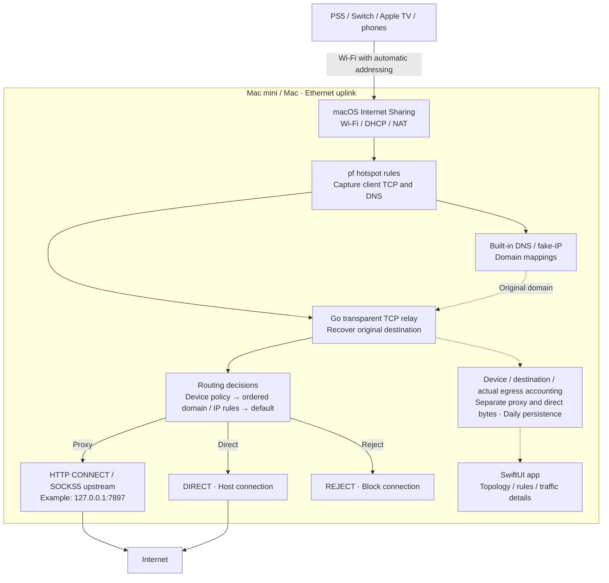

# LAN Proxy Gateway

[](https://github.com/Tght1211/lan-proxy-gateway/releases/latest)
[](https://go.dev/)
[]()
[](LICENSE)

Connect a Switch, PS5, Apple TV, phone, or TV to proxy Wi-Fi to use your existing proxy—no client proxy app or manual static IP, gateway, or DNS settings required. On an Ethernet-connected Mac mini / Mac, enable macOS Internet Sharing and hotspot takeover in this app to reuse Clash, Mihomo, sing-box, or another HTTP/SOCKS5 proxy.

Mac and Linux hosts also support LAN gateway mode for devices configured with a manual gateway.

> [!IMPORTANT]
> This project provides no proxy nodes, subscriptions, or streaming unlocks. Service availability depends on your external proxy software and node.

[中文](README.md) · [Latest release](https://github.com/Tght1211/lan-proxy-gateway/releases/latest) · [Documentation](docs/README.md)

<p align="center">
  
  
  
  
</p>

## Features

- **Proxy Wi-Fi (Ethernet-connected Mac):** use macOS Internet Sharing to assign client IP, gateway, and DNS settings automatically; enable hotspot takeover in the app while preserving the Mac’s system proxy and DNS settings.
- **LAN gateway:** route client IPv4 TCP traffic directly or through one HTTP/SOCKS5 upstream.
- **Original-domain forwarding:** fake-IP preserves domains for Clash/sing-box routing without requiring TUN mode.
- **Lightweight routing:** device policy precedes domain, domain-suffix, and IP-CIDR rules; choose proxy, direct, or reject, with per-domain learning and temporary per-device direct protection during failure bursts.
- **Native macOS app:** inspect traffic topology, clients, services, connection outcomes, and network quality; manage rules, proxy settings, and the gateway core.
- **Native networking:** `pf` on macOS and `iptables` on Linux, with precise cleanup of rules and system state on shutdown.

LAN Proxy Gateway is designed for an always-on computer with an existing proxy application or HTTP/SOCKS5 endpoint. It does not target Windows, consumer routers/OpenWrt, IPv6 transparent proxying, or proxied game/voice UDP. Proxy mode rejects QUIC (UDP/443) so clients fall back to TCP; other UDP remains direct.

## Choose a connection mode

Both modes remain supported. Proxy Wi-Fi simplifies onboarding; manual IP and gateway configuration remains an option for existing LANs.

| Mode | Environment | Client setup |
|---|---|---|
| **Proxy Wi-Fi (recommended for Ethernet-connected Macs)** | macOS Internet Sharing with hotspot takeover enabled | Join the new Wi-Fi; obtain IP, gateway, and DNS automatically. No client proxy setting is needed. |
| **Manual gateway (optional)** | A Mac / Linux gateway on an existing LAN, without creating a hotspot | Stay on the existing Wi-Fi or wired LAN, assign a device IP, and point gateway and DNS settings to the gateway host. |

For manual setup, choose an unused IP in the same subnet that DHCP will not allocate to another device: reserve it on the main router or use an address outside its DHCP pool. See the connection instructions below and the [device guide](docs/device-setup.md). Switching access modes requires a core restart.

## Technical architecture

The system combines **macOS Internet Sharing, a Go gateway core, and an external proxy upstream**. macOS manages Wi-Fi, DHCP, and NAT. The gateway handles transparent forwarding, routing decisions, and traffic accounting. Existing proxy software manages its own nodes and rules; the native SwiftUI app provides configuration and status views.

This diagram shows hotspot mode on an Ethernet-connected Mac. Solid arrows represent the main IPv4 TCP forwarding path; dotted arrows carry domain metadata or traffic statistics.


```mermaid
flowchart TD
    Device["PS5 / Switch / Apple TV / phones"] -->|Wi-Fi with automatic addressing| Hotspot
    subgraph Mac["Mac mini / Mac · Ethernet uplink"]
        Hotspot["macOS Internet Sharing<br/>Wi-Fi / DHCP / NAT"]
        Hotspot --> Capture["pf hotspot rules<br/>Capture client TCP and DNS"]
        Capture --> Relay["Go transparent TCP relay<br/>Recover original destination"]
        Capture --> DNS["Built-in DNS / fake-IP<br/>Domain mappings"]
        DNS -.->|Original domain| Relay
        Relay --> Rules["Routing decisions<br/>Device policy → ordered domain / IP rules → default"]
        Rules -->|Proxy| Proxy["HTTP CONNECT / SOCKS5 upstream<br/>Example: 127.0.0.1:7897"]
        Rules -->|Direct| Direct["DIRECT · Host connection"]
        Rules -->|Reject| Reject["REJECT · Block connection"]
        Relay -.-> Stats["Device / destination / actual egress accounting<br/>Separate proxy and direct bytes · Daily persistence"]
        Stats -.-> UI["SwiftUI app<br/>Topology / rules / traffic details"]
    end
    Proxy --> Internet["Internet"]
    Direct --> Internet
```

| Layer | Implementation |
|---|---|
| Hotspot and addressing | Reuses macOS Internet Sharing for DHCP and NAT. Clients receive IP, gateway, and DNS settings automatically; the project does not run a separate DHCP server. |
| Transparent interception | macOS uses `pf rdr` and `DIOCNATLOOK`; Linux manual gateway mode uses `iptables REDIRECT` and `SO_ORIGINAL_DST`. Clients do not need an HTTP proxy setting. |
| DNS and domain recovery | In proxy mode, fake-IP mappings preserve original domains for routing and upstream proxy handling, without requiring the proxy application's TUN mode. |
| Routing and egress | Device policy takes precedence over ordered domain, domain-suffix, and IP-CIDR rules, followed by the default egress. Supports HTTP CONNECT, SOCKS5, direct, and reject; upstream proxy rules still apply. |
| Isolation | Hotspot takeover is scoped to the sharing interfaces and source subnet, preserving the Mac's default route, system proxy, and DNS settings. Sharing changes trigger reapplication of project rules. |
| Observability | Upload and download counters are grouped by device IP, date, destination, and actual proxy endpoint. Direct fallback is counted as direct. Daily aggregates persist locally; the app reads runtime data through a local status API. |

**Accounting and protocol boundaries:** bytes attributed to `127.0.0.1:7897` measure traffic this gateway sends to that upstream endpoint. If the upstream chooses direct routing, those bytes still count as proxy-endpoint traffic; this is not remote-node consumption or provider billing. Device identity is IP-based, so reassignment can affect attribution. HTTPS is not decrypted and page contents are not recorded. The diagram does not imply general UDP proxy support: proxy mode blocks QUIC (UDP/443) to encourage TCP fallback; other UDP remains direct. IPv6 transparent proxying is unsupported.

See the [architecture](docs/architecture.md) and [hotspot guide](docs/hotspot-setup.md) for implementation details (Chinese).

## Quick start

### 1. Install

On macOS, download the DMG from [GitHub Releases](https://github.com/Tght1211/lan-proxy-gateway/releases/latest). The app and CLI share the same `gateway` core.

For the CLI on macOS or Linux:

```bash
curl -fsSL https://raw.githubusercontent.com/Tght1211/lan-proxy-gateway/main/install.sh | bash
sudo gateway install
```

Administrator access is required to bind DNS, enable IP forwarding, and configure the firewall. Routine status and configuration commands do not require persistent root access after service installation.

### 2. Configure egress

Set the proxy in the app, or run `sudo gateway` and choose **Set proxy**. A proxy on the same host commonly looks like this; use the actual port shown by your proxy software:

```text
Type     HTTP
Address  127.0.0.1
Port     7897
```

Direct egress is also supported when you only need a LAN gateway.

The gateway DNS listener defaults to internal port `1053`. If occupied, the gateway selects and saves a fallback port. LAN devices continue using standard DNS port `53`, forwarded by the gateway firewall; no Clash DNS changes are needed. Available ports in existing configurations are preserved.

### 3. Connect a device

**Recommended for Switch / PS5: proxy Wi-Fi on an Ethernet-connected Mac**

Open the device onboarding guide in the app:

1. In macOS System Settings, share Ethernet to Wi-Fi and set a network name and password.
2. Return to the app, configure the proxy upstream, and enable hotspot takeover.
3. Connect the console to the new Wi-Fi. Keep IP and DNS automatic and the device proxy disabled.

No static IP selection is needed. Initial Internet Sharing setup is manual; test actual game connectivity on your console. See the [hotspot guide and limitations](docs/hotspot-setup.md) (Chinese).

**Optional: manual IP and gateway setup (Mac / Linux)**

Run `gateway status`, then enter the reported values on the phone, TV, or console:

| Device setting | Value |
|---|---|
| IP configuration | Manual / static |
| IP address | An unused address in the same subnet; unique per device |
| Subnet mask | `255.255.255.0`; usually prefix length `24` on Android |
| Gateway / router | Gateway host's LAN IP |
| DNS 1 | Gateway host's LAN IP |
| DNS 2 | Same value, or blank if duplicates are rejected |
| Device proxy | None / disabled |

Reconnect Wi-Fi and run `gateway status` again. Only the device IP differs between clients; gateway and DNS always use the gateway host's IP.

Detailed device guides are available from the [documentation index](docs/README.md). Troubleshooting is covered in the [FAQ](docs/faq.md).

## Documentation

| Topic | Links |
|---|---|
| Device setup | [Overview](docs/device-setup.md) · [Phone](docs/phone-setup.md) · [Switch](docs/switch-setup.md) · [PS5](docs/ps5-setup.md) · [Apple TV](docs/appletv-setup.md) · [TV](docs/tv-setup.md) |
| Operation | [macOS app](docs/app.md) · [Commands](docs/commands.md) · [Configuration](docs/advanced.md) · [Scenarios](docs/scenarios.md) |
| Internals | [Architecture](docs/architecture.md) · [Real-device results](docs/real-device-results.md) · [FAQ](docs/faq.md) |
| Upgrade and automation | [v3 migration](docs/migration-v4.md) · [AI-assisted setup](docs/ai-setup.md) · [Changelog](CHANGELOG.md) |

Most detailed guides are currently written in Chinese. Start from [docs/README.md](docs/README.md).

## Build from source

```bash
make build       # CLI
make test        # Go tests
make build-app   # macOS app
```

See the [app guide](docs/app.md) and [architecture](docs/architecture.md) for packaging and repository structure.

## License

[MIT](LICENSE) © 2025-2026 [Tght1211](https://github.com/Tght1211)
