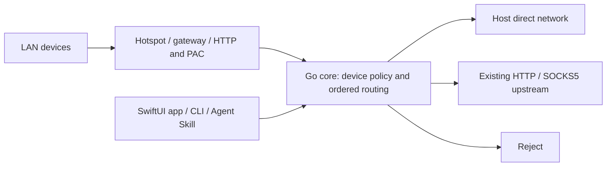

# LAN Proxy Gateway

[](https://github.com/Tght1211/lan-proxy-gateway/releases/latest)
[](https://go.dev/)
[](LICENSE)

**Share your existing proxy with LAN devices.** An Ethernet-connected Mac can provide proxy Wi-Fi for a PS5, Switch, Apple TV or phone. Mac / Linux also support a manual gateway; proxy-aware clients can use HTTP / PAC.

[Download](https://github.com/Tght1211/lan-proxy-gateway/releases/latest) · [中文](README.md) · [Documentation](docs/README.md)

> No proxy nodes or subscriptions are provided. Bring an existing Clash, Mihomo, sing-box or HTTP/SOCKS5 endpoint. Availability depends on your upstream and the destination.

## Application


Scroll from key metrics to the topology and compact exit cards (up to three columns). Exits no longer have a separate menu. Quarterly traffic separates recorded proxy/direct usage; global health summarizes observed exits, with per-exit details below.

<details>
<summary>More running screenshots: exit cards, traffic and classified learning</summary>
<p align="center">
  
  
</p>
<p align="center"></p>
</details>

Captured from the current running application. Addresses, visited domains and local paths are redacted; metrics are not fabricated demo values.

## Features

- **Three access options:** macOS Internet Sharing hotspot, manual gateway, or HTTP proxy / PAC. Preserve the Mac's system proxy and DNS.
- **Routing:** device policy takes precedence; exact domains, domain suffixes and IP-CIDR rules select proxy, direct or reject.
- **Automatic proxy learning:** unmatched targets try direct first, then the proxy on eligible dial/initial-response failures. Only observed proxy response data adds evidence. Save automatically or review manually at the configured threshold; explicit rules and deny-direct protections take precedence.
- **Large learning lists:** distinguish pending, saved and paused records; combine service, route, scope and text filters with 50-row pages. Legacy direct rules stay identifiable. Pausing learning does not block traffic.
- **Usage and diagnosis:** daily recorded device, ingress, destination and actual-exit totals, plus live connections, failures and exit health.
- **External AI Agents:** export a Skill for CLI-based diagnosis and authorized control. No in-app model or API key is required.

## Quick start

### 1. Install and choose an upstream

On macOS, download the [DMG from Releases](https://github.com/Tght1211/lan-proxy-gateway/releases/latest) and drag the app into Applications. Configure your existing upstream's actual type, address and port in Network Overview. The LAN HTTP sharing port is not the upstream port.

CLI installation on macOS / Linux:

```bash
curl -fsSL https://raw.githubusercontent.com/Tght1211/lan-proxy-gateway/main/install.sh | bash
sudo gateway install
```

### 2. Choose access

| Method | Host requirements | Client setup |
|---|---|---|
| **Wi-Fi hotspot** | Ethernet-connected Mac; enable Internet Sharing in macOS, then hotspot takeover in the app | Join the hotspot, keep IP/gateway/DNS automatic; no client proxy app |
| **Manual gateway** | Mac / Linux on the same LAN | Choose an unused static IP in the actual subnet; point gateway and DNS to the host |
| **HTTP / PAC** | Enable the app's LAN HTTP listener and save port/authentication | Set server/port manually or use its `proxy.pac` URL; no gateway/DNS change |

[Hotspot guide](docs/hotspot-setup.md) · [Device guides](docs/device-setup.md) · [HTTP / PAC](docs/app.md#局域网-http-代理接入)

Hotspot/manual-gateway mode changes need a core restart, which interrupts existing connections. Firewall and system-service operations may require OS administrator authorization.

### 3. Inspect and adjust

Use Network Overview for topology/exits, Device Access for usage, Traffic Records for connections and learning, Routing Rules for policy, and Settings for access, CLI, Agent and runtime options. Visited pages retain filters and scroll position when switching.

## Control with an AI Agent

Export the Skill ZIP from **Settings → CLI and Agent (设置 → CLI 与 Agent)**, then give it and the copied installation prompt to a Skill-capable agent such as Codex with command access on the gateway host. Install the entire `lan-proxy-gateway/` directory. Re-export and update the installed copy after application upgrades.

The Skill includes a read-only summary and classified pagination helper so thousands of rules need not fill the conversation. The management API remains local and independently authenticated. Agents inspect first and change only within user authorization; they must not silently restart the core or expose remote management.

[Installation and command reference](docs/agent-skill.md)

## Limits and accounting

- **One HTTP/SOCKS5 upstream** is configured. Multiple exit cards do not mean multiple proxy nodes are supported.
- No Windows, OpenWrt or IPv6 transparent proxy support. The HTTP listener cannot carry arbitrary UDP. Proxy mode blocks QUIC (UDP/443) to encourage TCP fallback; other UDP remains direct. Test game NAT and connectivity on the actual console.
- Usage counts forwarded gateway bytes only—not bypass traffic, other Mac apps' proxy traffic, protocol overhead or a provider's bill. Older records without exit classification cannot be reconstructed as proxy usage.
- Daily aggregates persist; individual connections remain memory-only for up to 72 hours and 2,000 records. Response data does not prove application-level success; HTTPS is not decrypted.

## Architecture and development


```mermaid
flowchart LR
    Device[LAN devices] --> Access[Hotspot / gateway / HTTP and PAC]
    Access --> Core[Go core: device policy and ordered routing]
    Core --> Direct[Host direct network]
    Core --> Proxy[Existing HTTP / SOCKS5 upstream]
    Core --> Reject[Reject]
    App[SwiftUI app / CLI / Agent Skill] --> Core
```

The app and CLI share the same core/configuration. macOS uses `pf`; Linux uses `iptables`. Shutdown restores state changed by the gateway.

```bash
make build
make test
make build-app
make dmg VERSION=v4.5.0
make skill VERSION=v4.5.0
```

Full Xcode or the GitHub macOS runner produces a universal app; Command Line Tools-only builds use the host architecture for the SwiftUI shell.

[App documentation](docs/app.md) · [Architecture](docs/architecture.md) · [Troubleshooting](docs/faq.md) · [Changelog](CHANGELOG.md) · [v4.5.0 release notes](docs/releases/v4.5.0.md)

## License

[MIT](LICENSE)
