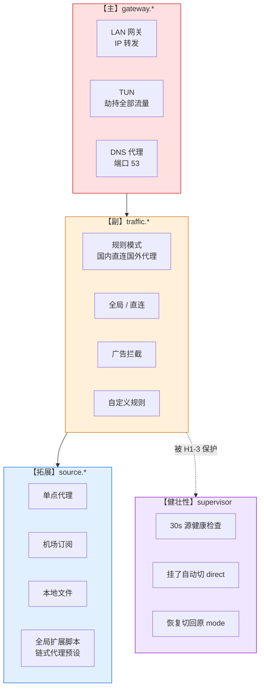

# 架构与跨平台实现

## 🌍 跨平台支持

| 系统 | IP 转发 | NAT | 服务管理 | 本机 DNS 一键切 |
|---|---|---|---|---|
| **macOS** | `sysctl net.inet.ip.forwarding` | `pfctl` | `launchd` plist | ✅ `networksetup`（自动遍历所有活跃网卡） |
| **Linux** | `/proc/sys/net/ipv4/ip_forward` | `iptables MASQUERADE` | `systemd` unit | ⚠️ 手动（见 [device-setup.md](device-setup.md#linux-手动)） |
| **Windows** | 注册表 `IPEnableRouter=1` | ❌ 家用版没 RRAS/无 NAT | `schtasks` 计划任务 | ⚠️ 不推荐切（见 [device-setup.md](device-setup.md#windows)） |

编译产物 5 平台均通过：`darwin-arm64 / darwin-amd64 / linux-amd64 / linux-arm64 / windows-amd64`。

> Linux / Windows 欢迎 PR 贡献一键 DNS 切换 / 更完善的服务管理。

---

## 🧩 三层架构



---

## 🛠️ 手动编译

```bash
git clone https://github.com/Tght1211/lan-proxy-gateway
cd lan-proxy-gateway

make build            # 当前平台 → ./gateway
make install          # 装到 /usr/local/bin/gateway（需 sudo）
make test             # 全部单元测试
make build-all        # 交叉编译 darwin / linux / windows
```

国内网络拉依赖慢：`GOPROXY=https://goproxy.cn,direct go build -o gateway .`

---

## 📁 目录结构

```
cmd/                cobra 入口（install / start / stop / status / service …）
internal/
  app/              统一门面（console + cobra 共用）+ supervisor（代理源自愈）
  gateway/          【主】LAN 网关 + 设备接入指引
  traffic/          【副】规则 + 内置 ruleset + 自定义合并
  source/           【拓展】代理源 inline + 连通性测试
  engine/           mihomo 进程 + 渲染 + REST API（SelectNode / GroupDelay / SetMode）
  script/           goja 脚本执行器
    presets/        内嵌预设（链式代理 · 住宅 IP 落地）
  config/           v3 schema（v1/v2 自动迁移）
  platform/         跨平台（darwin/linux/windows）
  console/          菜单式交互 + 日志易读视图 + 显示宽度对齐
  mihomo/           下载 mihomo 内核
embed/
  template.yaml     mihomo config 模板
  webui/            metacubexd dist（2 MB+，go:embed all:）
legacy/v1/          v1 源码留档
```
