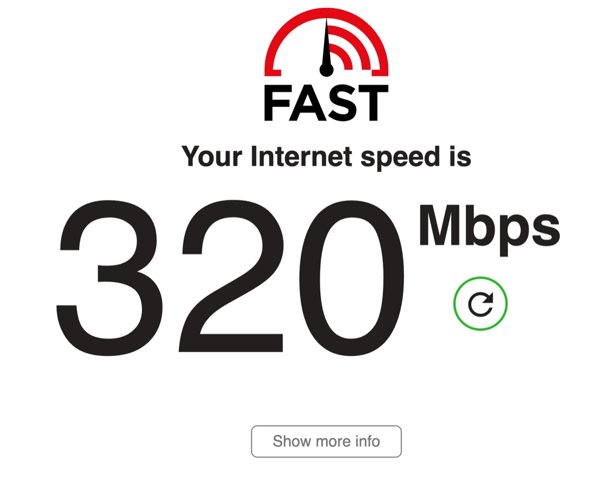
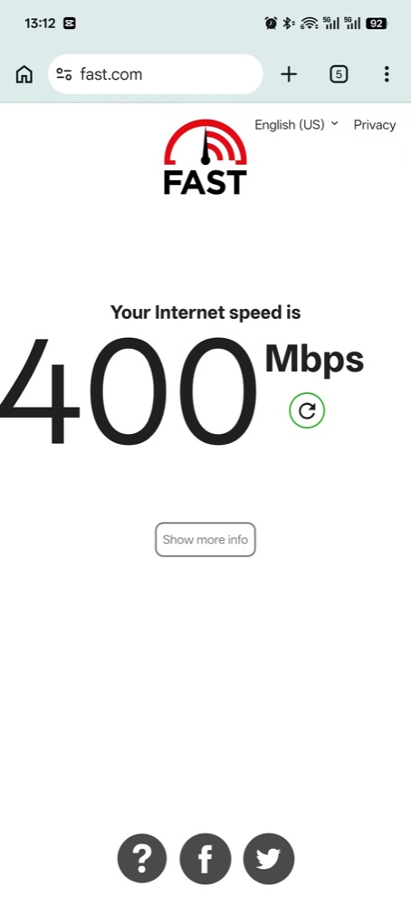
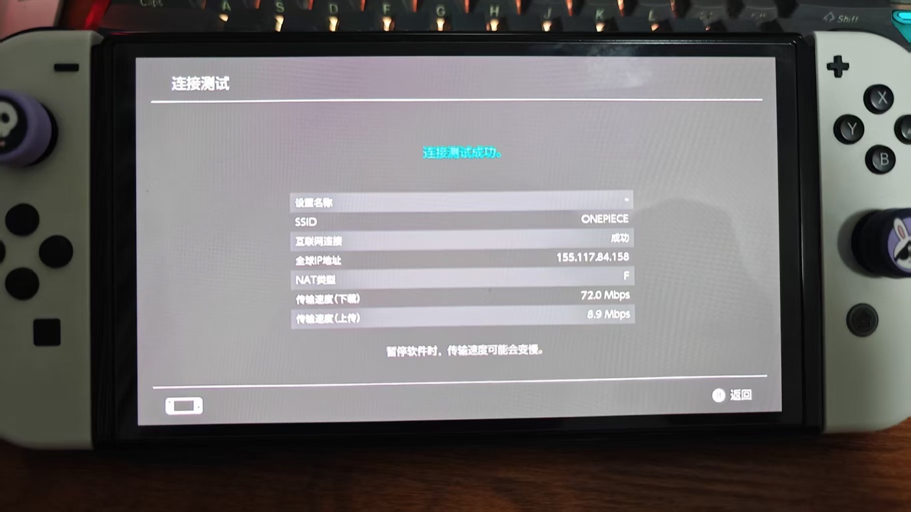
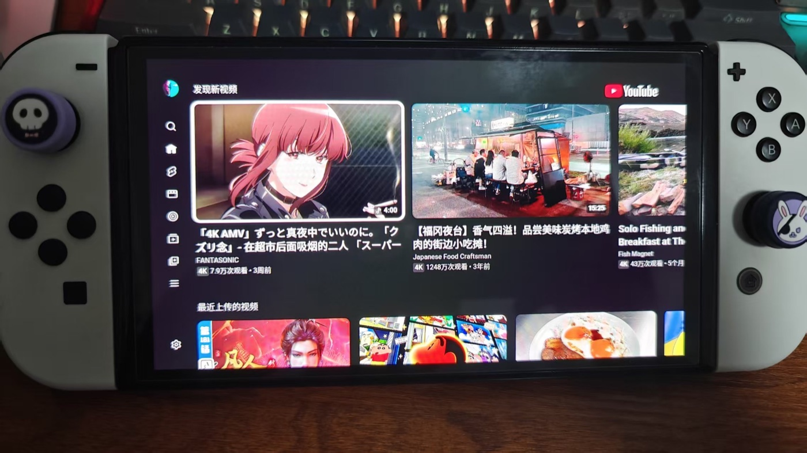

# 实机结果

[返回文档索引](README.md)

以下结果用于展示真实设备已经通过 LAN Proxy Gateway 工作，不代表固定性能承诺。速度、NAT 类型和内容可用性取决于 Wi-Fi、运营商、外部代理软件、节点及其分流规则。

## 吞吐

同一上游代理下，PC 直接使用第三方代理约为 `320 Mbps`，局域网手机经 gateway 测得约 `400 Mbps`。测速会随时段和节点波动；这组结果只能说明测试中 gateway 没有形成明显的固定带宽上限，不能说明它会让物理网络变快。

| PC 直接使用第三方代理 | 手机经 gateway 使用同一代理 |
|---|---|
|  |  |

## Nintendo Switch

Switch 将网关和 DNS 指向运行 gateway 的主机后，连接测试得到约 `72.0 Mbps` 下载、`8.9 Mbps` 上传。

配置代理出口后，Switch 可以通过已有代理访问 YouTube。外部代理节点到 Nintendo 下载源线路更好时，游戏下载速度也可能改善。

LAN Proxy Gateway 本身不提供线路、节点或流媒体解锁能力。
